# 思路

[TOC]

## 框架内容

参考资料：

- [CSE 599W： Systems for ML博客](http://jcf94.com/2018/10/04/2018-10-04-cse559w/)
- [CSE 599W： Systems for ML](http://dlsys.cs.washington.edu/)

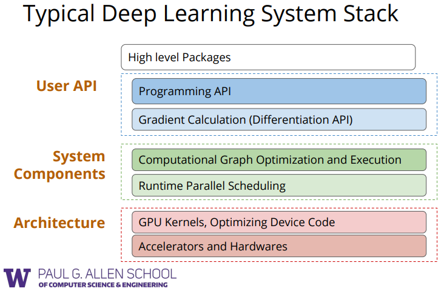

- 调用API
  - python
  - c++/cuda
  - 其他硬件加速方法
- 自动求导方法（``autodiff``）
- 内存共享优化
- 网络结构表示方法
- 计算图执行和优化

## 程序求导的四种方法

参考资料：

- [自动微分(Automatic Differentiation)简介](https://blog.csdn.net/aws3217150/article/details/70214422)
- [Automatic Differentiation in Machine Learning: a Survey](https://arxiv.org/pdf/1502.05767.pdf)
- [Dual Numbers & Automatic Differentiation](https://blog.demofox.org/2014/12/30/dual-numbers-automatic-differentiation/)

#### 手动求导 Manual Derivatives

 	这种求导方法在传统计算机视觉模型中比较常用，也就是模型方法会定义一个能量函数之类的量。需要优化的变量则通过对能量函数进行理论求导之后再在代码中实现。很明显，这种方法几乎没有什么可拓展性。

#### 数值微分 Numerical Differentiation

 	主要利用导数的定义：
$$
\begin{align}\label{eq:der}
\dfrac{\partial f(x)}{\partial x_i}\approx\dfrac{f(x+he_i)-f(x)}{h}
\end{align}
$$
这样输出量$f(x)$的梯度$\nabla f=\left(\dfrac{\partial f}{\partial x_i},\cdots,\dfrac{\partial f}{\partial x_n}\right)$，其中$e_i$是第$i$个元素为1其他为0的单位向量，$h$是一个很小的步长。这种方法比较容易实现，但是存在比较多的问题。

 	第一，这种方法只能近似。误差来源主要有两个，第一个是截断误差（truncate error），这是式$\eqref{eq:der}$造成的，主要是由于$h\neq 0$引起的；另一个误差来源是舍入误差（round-off error），主要是由于计算机本身表示上无法完全与理论相等，$f(x+he_i)$与$f(x)$在表示时存在误差。当$h\rightarrow 0$时，截断误差趋于0，但是舍入误差占主导；而随着$h$增大，截断误差则占据主导。

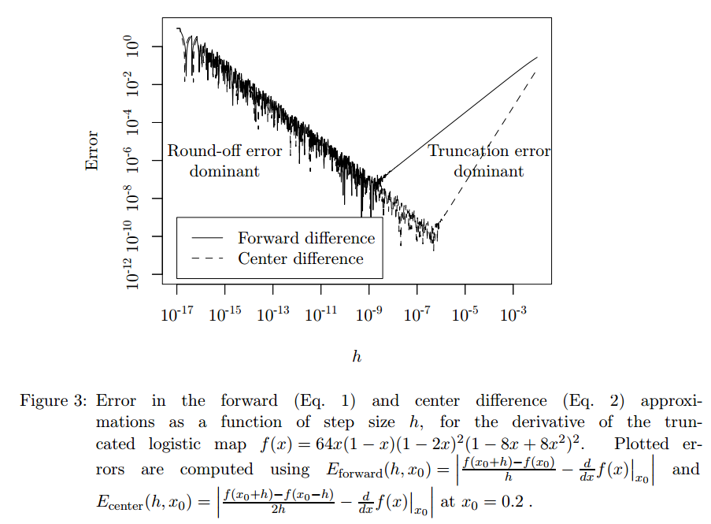

 	一种改进方法是不用式$\eqref{eq:der}$的前向方式，改为中心式的：
$$
\begin{align}
\dfrac{\partial f(x)}{\partial x_i}\approx\dfrac{f(x+he_i)-f(x-he_i)}{2h}+O(h^2)
\label{eq:centered_deriv}
\end{align}
$$
*这能去掉一阶截断误差*（当然更高阶的截断误差仍然存在）。由式$\eqref{eq:centered_deriv}$，每次计算一个方向的梯度就要执行两次函数$f$。对于一个$n$维的输入变量和一个$f:\mathbb{R}^{n}\rightarrow\mathbb{R}^m$，计算一个雅可比矩阵需要执行$2mn$次$f$函数。

 	第二个问题是，各个维度的敏感度不同，步长$h$不能很好的确定。如果$x$本身的量级与$h$差不多，这种方法就会造成问题。

 	第三个问题，也是这种求导方法最主要的问题就是计算的复杂度。当$n$增大到成千上万时，计算这一梯度就成了主要的问题。相比于第一个误差问题，在深度学习的语境下，这种误差的容忍度较高。

#### 符号微分 Symbolic Differentiation

 	符号求导在现在的一些数学软件如``Mathematica``/``Maple``中已经应用了，比如针对复合函数：
$$
\begin{align}
\frac{d}{dx}\left(f(x)+g(x)\right)&=\frac{d}{dx}f(x)+\frac{d}{dx}g(x)\\
\frac{d}{dx}f(x)g(x)&=\left(\frac{d}{dx}f(x)\right)g(x)+f(x)\left(\frac{d}{dx}g(x)\right)\\
\frac{d}{dx}\frac{f(x)}{g(x)}&=\frac{f'(x)g(x)-f(x)g'(x)}{g(x)^2}
\end{align}
$$
符号微分旨在为人提供一种直观的闭式解的自动微分。因此如果能将问题转化为一个纯数学符号问题，那么也就能用这类符号微分方法进行自动求解了。

 	符号微分自然也存在问题。其一是带求解问题必须能转化为一个数学符号表达式；其二，更重要的问题是，随着复合函数嵌套层数的增加，符号微分会遇到所谓的“表达式膨胀”（expression swell）问题：

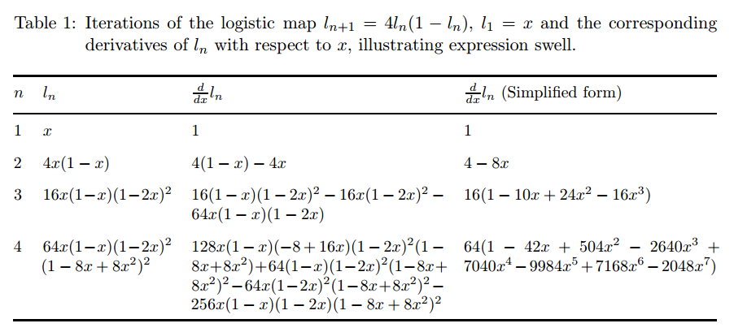

如果不加处理，为了计算嵌套函数的梯度，可能需要多次执行同一个表达式，这就造成实际所需的符号表达式将呈指数级增长，比如中间一列。事实上，我们可以看到$n=4$时的导数中有很多基本表达式在之前也出现过，我们可以保留一些中间结果避免再次计算。

#### 自动微分 Auto Differentiation

 	自动微分技术可以看成是在执行一个计算机程序，只不过其中一步可能是对某些公式进行求导。由于所有数学计算最终都可以被分解为有限个基本操作，并且这些基本运算的梯度是已知的，通过链式法则对这些导数进行运算和组合就能计算出完整的结果。这些基本算子包括：二值逻辑运算，单元符号转换运算，超越函数（比如指数），对数函数和三角函数等。现在的深度学习框架都是使用AD方法实现自动求导的。

 	自动微分技术包括两种模式：前向模式（forward mode / tangent linear mode）和反向模式（reverse mode / cotangent linear mode）。假定一个函数$f(x_1,x_2)=\ln(x_1)+x_1x_2-\sin(x_2)$，并定义：

- 变量$v_{i-n}=x_i, i=1,\cdots,n$为输入变量；
- 变量$v_i ~i=1,\cdots,l$是中间变量；
- 变量$y_{m-i}=v_{l-i},~i=m-1,\cdots,0$为输出变量。

现在通过对这一函数的求导过程来解释AD的前向和反向模式。

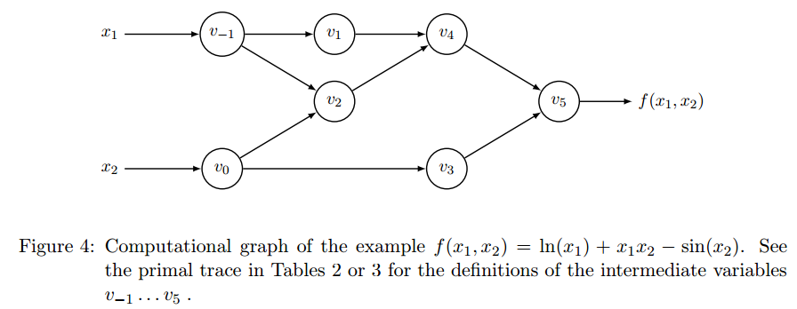

##### 前向模式

 	前向模式的思路比较简单直接：根据计算图，我们利用链式法则自前向后逐个计算各中间变量相对于输入变量的导数：
$$
\begin{align}
\dot{v}_i=\frac{\partial v_i}{\partial x_1}
\end{align}
$$
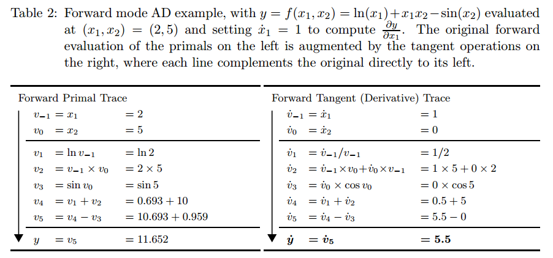

给定一个数学表达式$f(x)$，它可以用一系列算子（加减乘除三角函数指数对数等）的组合表示。前向计算中每一步都对应一步函数计算和一步导数计算（即执行$f$和计算梯度同时进行），导数计算的依据则来自于函数。通过合适的数据表示方法，我们只需编写这些基础算子的前向计算和求导过程即可。

 	这一思路推广到多维数据和多维函数$f:\mathbb{R}^n\rightarrow\mathbb{R}^m$，其中$n$是输入变量的维度，$m$是输出变量的维度。求解其雅可比矩阵的每个元素时，可以在每个前向AD中设置为$\dot{\mathbf{x}}=\mathbf{e}_i$（即只有第$i$个元素为1，其他为0的单位向量）作为输入进行计算：
$$
\begin{align}
\dot{y}_j=\frac{\partial y_j}{\partial x_i}\Bigg|_{\mathbf{x}=\mathbf{a}},~~~j=1,\cdots,m
\end{align}
$$
那么整个雅可比矩阵为：
$$
\begin{equation}
\mathbf{J}_f=\begin{bmatrix}
\frac{\partial y_1}{\partial x_1} & \cdots & \frac{\partial y_1}{\partial x_n} \\
\vdots & \ddots & \vdots \\
\frac{\partial y_m}{\partial x_1} & \cdots & \frac{\partial y_m}{\partial x_n}
\end{bmatrix}
\Bigg|_{\mathbf{x}=\mathbf{a}}
\end{equation}
$$
或者可以初始化$\dot{\mathbf{x}}=\mathbf{r}$，用矩阵形式来计算：
$$
\begin{equation}
\mathbf{J}_f\mathbf{r}=\begin{bmatrix}
\frac{\partial y_1}{\partial x_1} & \cdots & \frac{\partial y_1}{\partial x_n} \\
\vdots & \ddots & \vdots \\
\frac{\partial y_m}{\partial x_1} & \cdots & \frac{\partial y_m}{\partial x_n}
\end{bmatrix}
\begin{bmatrix}
r_1 \\
\vdots \\
r_n
\end{bmatrix}
\end{equation}
$$
这种前向表示对$f:\mathbb{R}\rightarrow\mathbb{R}^m$类型的函数比较高效和直接，只需要执行$f$一次即可；但对于另一种极端形式$f:\mathbb{R}^n\rightarrow\mathbb{R}$，则需要执行$n$次$f$函数的流程。对于一个$f:\mathbb{R}\rightarrow\mathbb{R}^m$的映射，求解其导数需要$n~c~\mathrm{ops}(f)$的运算时间（其中$c\lt6$，一般取$c\sim[2, 3]$）。我们知道实际使用中，输入的维度$n$往往远大于输出的维度$m$（即$n\gg m$），所以这使得AD的前向模式并不那么好用；而AD反向模式则能使运算时间降为$m~c~\mathrm{ops}(f)$。

###### 前向模式的实现：二元数求导法 Dual Number

 	AD的前向模式可以使用二元数求导法来方便的实现。

 	[二元数](https://zh.wikipedia.org/wiki/二元数)是实数的一种推广。二元数引入了一个“二元数单位”$\varepsilon$，满足$\varepsilon\neq0$且$\varepsilon^2=0$。每个二元数都具有$z=a+b\varepsilon$的形式（其中$a$和$b$是实数）。这种表达形式可以看成是对一般实数的一阶展开（$\varepsilon\neq0$），更高阶的数据则被消除掉了（$\varepsilon^2=0$）。根据泰勒展开，函数$f(x)$可表达为：
$$
f(x)=f(x_0)+f'(x_0)(x-x_0)+\cdots+\frac{f^{(n)}(x_0)}{n!}(x-x_0)^n+R_n(x)
$$
所以如果忽略二阶项及更高阶项（$n\ge2$），$f(x)$在$x=x_0+\varepsilon$处满足：
$$
f(x)=f(x_0)+f'(x_0)\varepsilon
$$
二元数系数$b$即可看成是某函数$f(x)$在$x=a$处的导数。我们要做的就是为每个实数绑定一个二元数系数，并根据常用函数的求导法则更新该系数，就能获得任意复合函数在$x=a$处的导数了。

 	假定两个二元数分别为$x=a+b\varepsilon$和$y=c+d\varepsilon$，二元数的运算法则如下：

- 加法：
  $$
  \begin{equation}\begin{split}
  x+y&=(a+b\varepsilon)+(c+d\varepsilon)\\
  &=(a+c)+(b+d)\varepsilon
  \end{split}\end{equation}
  $$

- 减法：
  $$
  \begin{equation}\begin{split}
  x-y&=(a+b\varepsilon)-(c+d\varepsilon)\\
  &=(a-c)+(b-d)\varepsilon
  \end{split}\end{equation}
  $$

- 乘法：
  $$
  \begin{equation}
  \begin{split}
  x\times y&=(a+b\varepsilon)\times(c+d\varepsilon)\\
  &=(ac+cd)+(bc+ad)\varepsilon+bd\varepsilon^2\\
  &=(ac+cd)+(bc+ad)\varepsilon
  \end{split}
  \end{equation}
  $$

- 除法：
  $$
  \begin{equation}
  \begin{split}
  \frac{x}{y}&=\frac{a+b\varepsilon}{c+d\varepsilon}\\
  &=\frac{(a+b\varepsilon)(c-d\varepsilon)}{(c+d\varepsilon)(c-d\varepsilon)}\\
  &=\frac{ac+(bc-ad)\varepsilon}{c^2}\\
  &=\frac{a}{c}+\frac{bc-ad}{c^2}\varepsilon
  \end{split}
  \end{equation}
  $$

- 幂：
  $$
  \begin{equation}\begin{split}
  x^y&=(a+b\varepsilon)^{c+d\varepsilon}\\
  &=a^c+\varepsilon\left(b(ca^{c-1})+d(a^c\ln a)\right)
  \end{split}\end{equation}
  $$
  特别的，当指数为实数时：
  $$
  \begin{equation}\begin{split}
  x^y&=(a+b\varepsilon)^{c}\\
  &=a^c+(ca^{c-1})b\varepsilon
  \end{split}\end{equation}
  $$
  当底数为实数时：
  $$
  \begin{equation}\begin{split}
  x^y&=a^{c+d\varepsilon}\\
  &=a^c+d(a^c\ln a)\varepsilon
  \end{split}\end{equation}
  $$

- 三角函数：
  $$
  \begin{align}
  \sin(a+b\varepsilon)&=\sin(a)+\cos(a)b\varepsilon\\
  \cos(a+b\varepsilon)&=\cos(a)-\sin(a)b\varepsilon\\
  \tan(a+b\varepsilon)&=\tan(a)+\frac{1}{\cos(a)^2}b\varepsilon\\
  \arctan(a+b\varepsilon)&=\arctan(a)+\frac{1}{1+a^2}b\varepsilon
  \end{align}
  $$

- 对数函数：
  $$
  \begin{align}
  \log_s(a+b\varepsilon)=log_s(a)+\frac{1}{\ln(s)a}b\varepsilon
  \end{align}
  $$
  

一般的，令一个实数$a$对应的一个二元数为$a+\varepsilon$，则复合函数$F=f_1(f_2(f_3(...f_n(x)...)))$在$x=a$处的导数为：
$$
F'|_{x=a}=\mathrm{Dual}\left(F\left(a+\varepsilon\right)\right)
$$
因此，我们只需要编写一些针对二元数的基础运算法则和函数即可。需要注意的是，我们并不需要实际给$\varepsilon$进行赋值，只要记住它与虚数单位类似，是一个独立的单位即可。这里用``python``给个简单的实现：

```python
import numpy as np
import math


class DualNumber:
    def __init__(self, x, y):
        self.real = x
        self.dual = y

    def __str__(self):
        rpr = '{}+{}e'.format(self.real, self.dual)
        return rpr
    
    def __repr__(self):
        return self.__str__()

    def __add__(self, other):
        if isinstance(other, DualNumber):
            real = self.real + other.real
            dual = self.dual + other.dual
        elif np.isscalar(other):
            real = self.real + other
            dual = self.dual
        else:
            raise TypeError('The other operator should be a scalar or a {}'.format(self.__class__.__name__))
        return DualNumber(real, dual)

    def __radd__(self, other):
        return self.__add__(other)

    def __sub__(self, other):
        if isinstance(other, DualNumber):
            real = self.real - other.real
            dual = self.dual - other.dual
        elif np.isscalar(other):
            real = self.real - other
            dual = self.dual
        else:
            raise TypeError('The other operator should be a scalar or a {}'.format(self.__class__.__name__))
        return DualNumber(real, dual)

    def __rsub__(self, other):
        if isinstance(other, DualNumber):
            real = other.real - self.real
            dual = other.dual - self.dual
        elif np.isscalar(other):
            real = other.real - self.real
            dual = - self.dual
        else:
            raise TypeError('The other operator should be a scalar or a {}'.format(self.__class__.__name__))
        return DualNumber(real, dual)

    def __mul__(self, other):
        if isinstance(other, DualNumber):
            real = self.real * other.real
            dual = self.dual * other.real + self.real * other.dual
        elif np.isscalar(other):
            real = self.real * other
            dual = self.dual * other
        else:
            raise TypeError('The other operator should be a scalar or a {}'.format(self.__class__.__name__))
        return DualNumber(real, dual)

    def __rmul__(self, other):
        return self.__mul__(other)

    def __truediv__(self, other):
        if isinstance(other, DualNumber):
            if other.real == 0:
                raise ValueError
            real = self.real / other.real
            dual = (self.dual - self.real / other.real * other.dual) / other.real
        elif np.isscalar(other):
            if other == 0:
                raise ValueError
            real = self.real / other
            dual = self.dual / other
        else:
            raise TypeError('The other operator should be a scalar or a {}'.format(self.__class__.__name__))
        return DualNumber(real, dual)

    def __pow__(self, power, modulo=None):
        real = math.pow(self.real, power)
        dual = self.dual * power * math.pow(self.real, power-1)
        return DualNumber(real, dual)

    def __abs__(self):
        real = abs(self.real)
        dual = np.sign(self.real)
        return DualNumber(real, dual)

    @staticmethod
    def sin(a):
        real = math.sin(a.real)
        dual = a.dual * math.cos(a.real)
        return DualNumber(real, dual)

    @staticmethod
    def cos(a):
        real = math.cos(a.real)
        dual = - a.dual * math.sin(a.real)
        return DualNumber(real, dual)

    @staticmethod
    def tan(a):
        real = math.tan(a.real)
        x = math.cos(a.real)
        dual = a.dual / (x * x)
        return DualNumber(real, dual)

    @staticmethod
    def atan(a):
        real = math.atan(a.real)
        x = a.real
        dual = a.dual / (1. + x*x)
        return DualNumber(real, dual)

    @staticmethod
    def sqrt(a):
        real = math.sqrt(a.real)
        dual = .5 * a.dual / real
        return DualNumber(real, dual)

    @staticmethod
    def exp(a):
        real = math.exp(a.real)
        dual = a.dual * math.exp(a.real)
        return DualNumber(real, dual)

    @staticmethod
    def log(a, base=math.e):
        real = math.log(a.real, base)
        dual = 1. / a.real / math.log(base) * a.dual
        return DualNumber(real, dual)
```

##### 反向模式

 	反向传播BP可以看成AD反向模式的一种特例。不同于前向模式，反向模式需要计算输出对于每个中间变量$v_i$的梯度伴随量：
$$
\begin{align}
\bar{v}_i=\frac{\partial y_j}{\partial v_i}
\end{align}
$$
这一导数表征着输出变量$y_j$对于中间变量$v_i$的敏感程度。在BP算法中，$y$就是最后的损失函数值了。

 	在反向模式中，导数是通过一个两阶段的过程计算出来的。在第一个阶段中，我们执行函数$f$的计算，获得所有的中间变量$v_i$，并且在计算图中记录变量之间的依赖性和相关性；在第二阶段中，输出对输入的导数是通过反方向从输出到输入传播梯度伴随量得到的：

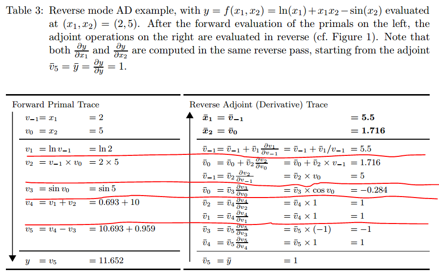

 	同样以函数$f(x_1,x_2)=\ln(x_1)+x_1x_2-\sin(x_2)$为例。前馈过程与AD前向模式中的情况一样（左列），但是求导则与之前的顺序相反，是从输出变量开始的。由于定义了$y=v_5$，所以$\bar{v}_5=\frac{\partial y}{\partial v_5}=1$；而$v_5$是由$v_3$和$v_4$两个变量计算得到的，并且：
$$
\begin{align}
\frac{\partial y}{\partial v_3}&=\frac{\partial y}{\partial v_5}\frac{\partial v_5}{\partial v_3}=\bar{v}_5\frac{\partial v_5}{\partial v_3}\\
\frac{\partial y}{\partial v_4}&=\frac{\partial y}{\partial v_5}\frac{\partial v_5}{\partial v_4}=\bar{v}_5\frac{\partial v_5}{\partial v_4}
\end{align}
$$
所以通过$\bar{v}_5$和$\frac{\partial v_5}{\partial v_3}$可以计算得到伴随量$\bar{v}_3$。$\bar{v}_4$类似。不难看出，这一过程就是本质上就是机器学习中的反向传播方法。只是此处输出$y$是变量（标量或矢量、矩阵），而不仅仅可以是机器学习中的损失函数值（标量）。另外值得一提的是，计算完$\bar{v}_3$和$\bar{v}_4$后，$\bar{v}_5$也就完成了任务，离开了其作用域（红线之间的几行为对应变量的作用域），可以在内存中释放掉。这可能也是``PyTorch``的``loss.backward()``实现中，一个结点完成反传后计算图被释放掉的原因。

 	对于输出到多个结点的中间变量，如$v_0$与$v_2$/$v_3$都相关，其梯度为：
$$
\begin{equation}\begin{split}
\frac{\partial y}{\partial v_0}&=\frac{\partial y}{\partial v_2}\frac{\partial v_2}{\partial v_0}+\frac{\partial y}{\partial v_1}\frac{\partial v_1}{\partial v_0}\\
&=\bar{v}_2\frac{\partial v_2}{\partial v_0}+\bar{v}_1\frac{\partial v_1}{\partial v_0}
\end{split}\end{equation}
$$
具体实现时，一般使用多步增量模式：
$$
\begin{align}
\bar{v}_0&=0\\
\bar{v}_0&=\bar{v}_0+\bar{v}_2\frac{\partial v_2}{\partial v_0}\\
\bar{v}_0&=\bar{v}_0+\bar{v}_1\frac{\partial v_1}{\partial v_0}
\end{align}
$$
 	上文中我们提到前向模式中，如果$f:\mathbb{R}^n\rightarrow\mathbb{R}$，那么计算所有针对输入变量的导数需要执行$n$次$f$函数流程；而在反向模式中，$f$函数流程执行次数则变为了$m$，即输出变量的维度。一次流程即可算出某个输出变量针对所有输入变量的导数：
$$
\nabla y_i=(\frac{\partial y_i}{\partial x_1}, \cdots,\frac{\partial y_i}{\partial x_n})
$$
在$n\gg m$的情况下， AD的反向模式能够有效降低执行计算量。反向模式也可以用矩阵向量化表达为：
$$
\mathbf{J}^T_f\mathbf{r}=\begin{bmatrix}
\frac{\partial y_1}{\partial x_1} & \cdots & \frac{y_m}{x_1} \\
\vdots & \ddots & \vdots \\
\frac{\partial y_1}{\partial x_n} & \cdots & \frac{y_m}{x_n}
\end{bmatrix}
\begin{bmatrix}
r_1 \\
\vdots \\
r_m
\end{bmatrix}
$$
其中初始化$\bar{\mathbf{y}}=\mathbf{r}$。

 	AD反向模式也有自身的缺陷，就是在最坏情况下导致计算所需内存空间增加（与反馈过程中的操作数量成比例）。如何优化和高效利用内存是一个比较热门的研究方向。

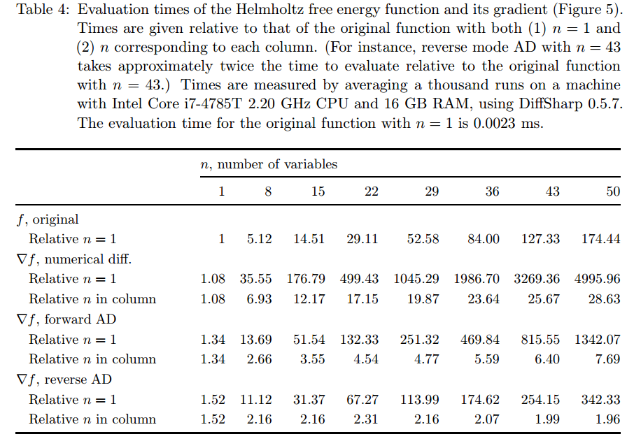

##### 自动微分实现类型

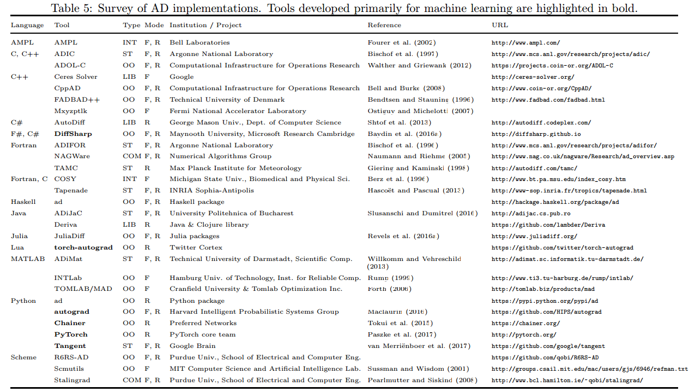

 	目前大部分AD方法大致可分为以下几种：

- 基础算子型（elemental）：这类实现方法主要通过将任意函数分解为有限个基础AD算子，并用基础AD算子替代基础数学算子来实现自动微分。在没有运算重载符的语言环境中，这种方法比较适用；
- 编译和源码转换型（compilers and source code transformation）：用另一种语法或扩展语言编写运算，然后再转换到原始编程语言上，比如用数学标记来表达目标函数和约束，再用解释器或编译器分析为编程语言；
- 运算符重载型（operator overloading）：现代编程语言支持运算符重载，这使得基础算子型的AD方法更加容易实现。

| 名称           | 编程语言 | 实现方法   | 支持模式  | 地址                                      |
| -------------- | -------- | ---------- | --------- | ----------------------------------------- |
| torch-autograd | Lua      | 运算符重载 | 反向      | https://github.com/twitter/torch-autograd |
| autograd       | Python   | 运算符重载 | 前向/反向 | https://github.com/HIPS/autograd          |
| Chainer        | Python   | 运算符重载 | 反向      | https://chainer.org/                      |
| PyTorch        | Python   | 运算符重载 | 反向      | https://pytorch.org/                      |
| Tangent        | Python   | 源码转换   | 前向/反向 | https://github.com/google/tangent         |

###### 源码转换型AD方法原理

参考资料：

-  [[python] ast模块](https://zhuanlan.zhihu.com/p/21945624)
- [ast --- 抽象语法树](https://docs.python.org/zh-cn/3/library/ast.html)

``Tangent``库通过对``Python``抽象语法树的修改，为部分系统数学运算以及``numpy``部分基础运算添加了自定义的求导函数并自动生成代码。具体代码尚未完全理解，这里自己简单记录下原理，并附上一些简单的代码辅助说明。

我们先得理解``Python``代码的执行过程：

> 语法分析 $\Longrightarrow$ 具体语法树 $\Longrightarrow$ 抽象语法树 $\Longrightarrow$ 控制流图 $\Longrightarrow$ 字节码 $\Longrightarrow$ 执行

``Tangent``库就用到了``gast``库（以``ast``库作为基础）对抽象语法树进行读取和补充。所以其中的关键就是如何利用``ast``和抽象语法树。

看一个简单的[例子](https://pycoders-weekly-chinese.readthedocs.io/en/latest/issue3/static-modification-of-python-with-python-the-ast-module.html)。先在代码中嵌入``expr``这一段``Python``代码，其中包括一个``add``函数，用来计算两个输入的和，然后执行并``print``：

```
>>> import ast
>>> expr = """
... def add(x,y):
...     return x + y
... print(add(3,4))
... """
>>> expr_ast = ast.parse(expr)
>>> expr_ast
<_ast.Module object at 0x7f61f2a58ac8>
```

``expr``经过``ast``模块解析后，得到的抽象语法树如下：

```python
>>> ast.dump(expr_ast)
Module(
	body=[
        FunctionDef(
            name='add', 
            args=arguments(
                args=[
                    arg(arg='x', annotation=None), 
                    arg(arg='y', annotation=None)
                ], 
                vararg=None, 
                kwonlyargs=[], 
                kw_defaults=[], 
                kwarg=None, 
                defaults=[]
            ), 
            body=[
                Return(
                    value=BinOp(
                        left=Name(id='x', ctx=Load()), 
                        op=Add(), 
                        right=Name(id='y', ctx=Load()))
                )
            ], 
            decorator_list=[], 
            returns=None
        ),
        Expr(
            value=Call(
                func=Name(id='print', ctx=Load()), 
                args=[
                    Call(
                        func=Name(id='add', ctx=Load()), 
                        args=[Num(n=3), Num(n=4)], 
                        keywords=[]
                    )
                ], 
                keywords=[]
            )
        )
    ]
)
```

可以看到，``expr``中自定义的函数在抽象语法树中位于``FunctionDef``这个``field``中，而其中具体算子（``+``）位于``FunctionDef.body.Return.value``中，名为``BinOp``，具体操作为``Add()``。接下来我们通过``ast``的转换模块，将``BinOp``这个域中的``Add()``函数修改为乘法（``ast.Mult()``）。

定义一个转换类，将``ast``中的结点进行修改。由于目标结点是``BinOp``，所以在其中定义一个``visit_BinOp``函数，并将其中``op``域替换为``ast.Mult()``：

```python
>>> class Transformer(ast.NodeTransformer):
...     def visit_BinOp(self, node):
...         node.op = ast.Mult()
...         return node
...
>>> trans = Transformer()
```

执行一下原始``expr``中的代码，$3+4=7$，``+``号执行的是加法：

```python
>>> exec(compile(expr_ast, '<string>', 'exec'))
7
```

接下来我们替换掉其中的加法：

```python
>>> modified = trans.visit(expr_ast)  # visit会调用所有visit_<classname>的方法
>>> ast.dump(modified)
Module(
	body=[
        FunctionDef(
            name='add', 
            args=arguments(
                args=[
                    arg(arg='x', annotation=None), 
                    arg(arg='y', annotation=None)
                ], 
                vararg=None, 
                kwonlyargs=[], 
                kw_defaults=[], 
                kwarg=None, 
                defaults=[]
            ), 
            body=[
                Return(
                    value=BinOp(
                        left=Name(id='x', ctx=Load()), 
                        op=Mult(), 
                        right=Name(id='y', ctx=Load())
                    )
                )
            ], 
            decorator_list=[], 
            returns=None
        ), 
        Expr(
            value=Call(
                func=Name(id='print', ctx=Load()), 
                args=[
                    Call(
                        func=Name(id='add', ctx=Load()), 
                        args=[Num(n=3), Num(n=4)], 
                        keywords=[])], 
                keywords=[]
            )
        )
    ]
)
```

可以看到，在第22行，原来``BinOp``域里的``op``已经被替换为了``x``乘法。执行一下新的抽象语法树：

```python
>>> exec(compile(modified, '<string>', 'exec'))
12
```

结果变成了$3\times 4=12$。

这个例子说明，我们能够通过``ast``模块注入并修改源代码。此处再给出一个例子，调用``numpy.add``（也就是``numpy.ndarray``的加法）然后通过``ast``注入修改为了减法。由于``numpy.add``并非系统函数，所以抽象语法树有些不同：

```python
import ast
expr = """
import numpy as np
def add(x, y):
    out = np.add(x, y)
    return out
a = np.zeros((1,3))
b = np.ones((1,3))
print(add(a, b))
"""

expr_ast = ast.parse(expr)
print(ast.dump(expr_ast))
```

获得上述代码的抽象语法树为：

```python
Module(
    body=[
        Import(
            names=[alias(name='numpy', asname='np')]
        ), 
        FunctionDef(
            name='add', 
            args=arguments(
                args=[arg(arg='x', annotation=None), 
                      arg(arg='y', annotation=None)], 
                vararg=None, 
                kwonlyargs=[], 
                kw_defaults=[], 
                kwarg=None, 
                defaults=[]
            ), 
            body=[
                Assign(
                    targets=[Name(id='out', ctx=Store())], 
                    value=Call(
                        func=Attribute(
                            value=Name(id='np', ctx=Load()), 
                            attr='add', 
                            ctx=Load()
                        ), 
                        args=[Name(id='x', ctx=Load()), 
                              Name(id='y', ctx=Load())], 
                        keywords=[]
                    )
                ), 
                Return(
                    value=Name(id='out', ctx=Load())
                )
            ], 
            decorator_list=[], 
            returns=None
        ), 
        Assign(
            targets=[Name(id='a', ctx=Store())], 
            value=Call(
                func=Attribute(
                    value=Name(id='np', ctx=Load()), 
                    attr='ones', 
                    ctx=Load()
                ), 
                args=[Tuple(elts=[Num(n=1), Num(n=3)], ctx=Load())], 
                keywords=[]
            )
        ), 
        Assign(
            targets=[Name(id='b', ctx=Store())], 
            value=Call(
                func=Attribute(
                    value=Name(id='np', ctx=Load()), 
                    attr='ones', 
                    ctx=Load()
                ), 
                args=[Tuple(elts=[Num(n=1), Num(n=3)], ctx=Load())], 
                keywords=[])
        ), 
        Expr(
            value=Call(
                func=Name(id='print', ctx=Load()), 
                args=[
                    Call(
                        func=Name(id='add', ctx=Load()),
                        args=[Name(id='a', ctx=Load()), Name(id='b', ctx=Load())], 
                        keywords=[]
                    )
                ], 
                keywords=[]
            )
        )
    ]
)
```

注入目标``numpy.add``位于第23行``Attribute.attr``内，所以修改的点就在这里：

```python
class EvilTransformer(ast.NodeTransformer):
    def visit_Attribute(self, node):
        if node.attr == 'add':
            node.attr = 'subtract'  # numpy中减法为numpy.subtract
        return node

trans = EvilTransformer()
new_ast = trans.visit(expr_ast)
exec(compile(new_ast, '<string>', 'exec'))
```

理论上，注入前，``expr``执行的结果应该是``[[1.,1.,1.]]``；注入后，输出结果就会变成``[[-1.,-1.,-1.]]``，成功将``numpy.add``改成了``numpy.subtract``。

注意，虽然``trans.visit``返回了“新”的抽象语法树变量``new_ast``，实际上该函数是对``expr_ast``直接进行了修改。所以``new_ast``和``expr_ast``是同一个变量的两个别名。

``ast``的作用在于，假如我们用某些算子编写了一个网络（函数），我们都够借助``ast``模块获得这一网络结构的抽象语法树，其中每个独立的结点都是一个运算语句。参考语句所使用的算子形式，编写对应的自动求导规则也就成了可能。

###### Tangent自动微分库

最后，简单分析下``Tangent``库是如何借助``ast``库来完成源码转换型的自动微分的。``Tangent``库中一些关键的函数有：

- [tangent.grads.create_register](https://github.com/google/tangent/blob/6533e83af09de7345d1b438512679992f080dcc9/tangent/grads.py#L79)

  ```python
  def create_register(dict_):
    def register(key):
      def _(f):
        dict_[key] = f
        return f
      return _
    return register
  ```

  这一函数用于生成一个作为装饰器的注册机。注册信息保存在``dict_``这一变量中。通过这类注册机，可以自定义某特定函数的微分函数。需要注意的是，**不需要该微分函数能运行，它只是作为模板用于自动生成真正微分函数的代码**。

- [tangent.grad](https://github.com/google/tangent/blob/6533e83af09de7345d1b438512679992f080dcc9/tangent/grad_util.py#L335)

  - 用于对某个函数进行求微分；
  - 适用于$f:\mathbb{R}^n\rightarrow \mathbb{R}$类型的函数；
  - 会检查输入是否为标量。

- [tangent.autodiff](https://github.com/google/tangent/blob/6533e83af09de7345d1b438512679992f080dcc9/tangent/grad_util.py#L220)

  - ``autodiff(f, mode='forward')``：AD前向模式，调用的关键函数：[ForwardAD](https://github.com/google/tangent/blob/6533e83af09de7345d1b438512679992f080dcc9/tangent/forward_ad.py#L48)
  - ``autodiff(f, mode='reverse')``：AD反向模式，调用的关键函数：[ReverseAD](https://github.com/google/tangent/blob/6533e83af09de7345d1b438512679992f080dcc9/tangent/reverse_ad.py#L100)

对于一个自定义的数学函数，``Tangent``库将会分析函数代码，并根据注册机内的微分函数模板，进行解析并生成一个对应的微分函数的``ast``抽象语法树，然后通过``astor``包将该抽象语法树转化回``python``源码。

###### autograd自动微分库

autograd自动微分库基于基础运算的重载，主要重载的是``numpy``包和``scipy``包。

## 自动求导实现思路

我们可以基于基础算子方法和运算符重载方法，在``Python``下实现一个自动微分的库。首先我们需要自定义一种数据类（例如``Tensorflow``中的``Variable``和``PyTorch``中的``tensor``数据类），库内所有基础算子将对其进行运算，并支持反向传播过程。在此基础上，我们只需要实现对该数据类的基础算子定义和运算符重载即可。

### 基础数据类型

为了简单起见，我们先利用``numpy``的``ndarray``作为基础，将其封装一层即作为自定义数据类，并将其命名为``Zhangliang``（“张量”拼音）：

```python
class Zhangliang(BaseZhangliang):
    def __init__(self, data, dtype=np.float64, requires_grad=False):
        if isinstance(data, Zhangliang):
            data = data.values
        elif np.isscalar(data):
            data = [data]

        self._zhi = np.array(data, dtype=dtype)
        self.requires_grad = requires_grad
        self._tidu = np.zeros_like(self._zhi)

    def assign_value(self, new_value):
        self._zhi = new_value

    def update_grad(self, grad_value):
        self._tidu += grad_value

    @property
    def grad(self):
        if not self.requires_grad:
            raise AttributeError('Tensor requires no gradient.')
        else:
            return self._tidu

    @property
    def values(self):
        return self._zhi

    @property
    def shape(self):
        return self._zhi.shape

    @property
    def ndim(self):
        return self._zhi.ndim

    @property
    def dtype(self):
        return self._zhi.dtype

    @property
    def size(self):
        return self._zhi.size

    def __iter__(self):
        return self._zhi.__iter__()

    def __len__(self):
        return len(self._zhi)

    def __getitem__(self, item):
        return self._zhi[item]

    def __repr__(self):
        return self._zhi.__repr__()

    def __str__(self):
        return self._zhi.__str__()

    @classmethod
    def zeros(cls, shape, dtype=np.float64, requires_grad=False):
        zeros_ = np.zeros(shape, dtype=dtype)
        return cls(zeros_, requires_grad=requires_grad)

    @classmethod
    def ones(cls, shape, dtype=np.float64, requires_grad=False):
        ones_ = np.ones(shape, dtype=dtype)
        return cls(ones_, requires_grad=requires_grad)

    @classmethod
    def zeros_like(cls, data, dtype=np.float64, requires_grad=False):
        shape = data.shape
        zeros_ = np.zeros(shape, dtype=dtype)
        return cls(zeros_, requires_grad=requires_grad)

    @classmethod
    def ones_like(cls, data, dtype=np.float64, requires_grad=False):
        shape = data.shapes
        ones_ = np.ones(shape, dtype=dtype)
        return cls(ones_, requires_grad=requires_grad)

    @classmethod
    def array(cls, data, requires_grad=False):
        if isinstance(data, Zhangliang):
            return cls(data.values, dtype=data.dtype, requires_grad=requires_grad)
        elif np.isscalar(data):
            return cls([data], dtype=np.int32, requires_grad=requires_grad)
        elif isinstance(data, (list, tuple)):
            return cls(data, dtype=np.float64, requires_grad=requires_grad)
        elif isinstance(data, collections.Iterable):
            data = np.array(data)
            return cls(data, dtype=np.float64, requires_grad=requires_grad)
        else:
            raise TypeError

    @classmethod
    def linspace(cls, start, stop, num):
        data = np.linspace(start, stop, num)
        return cls(data, dtype=data.dtype, requires_grad=False)

    @classmethod
    def arange(cls, start, stop=None, step=1):
        if stop is None:
            stop = start
            start = 0
        data = np.arange(start, stop, step)
        return cls(data, dtype=data.dtype, requires_grad=False)
```

目前定义的``Zhangliang``类仅包括其值（``Zhangliang.zhi``，本质就是``numpy.ndarray``），以及一些基础函数，尚未包括运算符重载。回顾下``PyTorch``和``Tensorflow``中的数据类，它们都支持``a+b``形式的调用。这在``Python``中是遵循了协议接口，调用其数据类的``__add__``方法；另一方面，在``PyTorch``和``Tensorflow``我们还能看到``tf.add(a,b)``和``torch.add(a,b)``形式的调用，这说明两个框架也存在着独立的基础算子。综合这两点，实际上我们只需要实现独立的基础算子，然后在``Zhangliang.__add__``方法中调用``add``算子即可：

```python
# 定义基础算子，并重载运算符
# 这里只展示基础四则运算

class Zhangliang(object):
     # 省略上述已有内容

     def __add__(self, other):
        return zl_add(self, other)

     def __radd__(self, other):
        return zl_add(other, self)

     def __sub__(self, other):
        return zl_sub(self, other)

     def __rsub__(self, other):
        return zl_sub(other, self)

     def __truediv__(self, other):
        return zl_truediv(self, other)


def zl_add(a, b):
    if isinstance(a, numbers.Real):
        value = a + b.zhi
    elif isinstance(b, numbers.Real):
        value = a.zhi + b
    else:
        value = a.zhi + b.zhi
    return Zhangliang(value)


def zl_sub(a, b):
    if isinstance(a, numbers.Real):
        value = a - b.zhi
    elif isinstance(b, numbers.Real):
        value = a.zhi - b
    else:
        value = a.zhi - b.zhi
    return Zhangliang(value)


def zl_mul(a, b):
    if isinstance(a, numbers.Real):
        value = a * b.zhi
    elif isinstance(b, numbers.Real):
        value = a.zhi * b
    else:
        value = a.zhi * b.zhi
    return Zhangliang(value)


def zl_truediv(a, b):
    if isinstance(a, numbers.Real):
        value = a / b.zhi
    elif isinstance(b, numbers.Real):
        if b == 0:
            raise ValueError('0 cannot be divisor.')
        value = a.zhi / b
    else:
        value = a.zhi / b.zhi
    return Zhangliang(value)

# 省略以下
```

定义这些运算比较简单，甚至求对应的微分过程也比较容易实现。但问题是：

- **如何注册前向和反向运算？**
- **我们在编写前馈运算时，怎么跟踪和记录运算过程？**
- **为了确定反传的执行顺序，怎么通过上述跟踪记录来获得计算图？**
- **如何进行反传？**

### 第一个问题：如何注册前向和反向函数？

第一个问题相对而言比较简单：我们定义两个字典：

```python
forward_func = dict()
backward_func = dict()
```

然后前馈函数和反馈函数各自以``{算子名：前馈/反馈函数}``对的方式进行注册。我们通过``Python``装饰器来进行注册，为此，先定义两个注册机：

```python
def create_register(dict_):
    def register(key):
        def _(fn):
            dict_[key] = fn
            return fn
        return _
    return register

forward_func = {}
forward_register = create_register(forward_func)
backward_func = {}
backward_register = create_register(backward_func)
```

那么只需要在基础算子定义前加上装饰器即可完成注册，比如以下代码可以将``zl_add``函数注册到前馈函数库中并注册为``{'add': zl_add}``：

```python
@forward_register(key='add')
def zl_add(a, b):
    pass
```

### 第二个问题：如何跟踪和记录运算过程？

即使注册了函数，我们仍需要跟踪和记录前馈过程的运算过程。假设有一个跟踪机``tracer``，在每次调用基础算子时，都需要记录算子的``Zhangliang``输入和输出，以及算子自身的类型。这一需求同样可以通过装饰器来实现：

```python
# create_tracer将定义一个计算图`graph_`，具体类型稍后介绍
# trave_with_name则是真正的装饰器函数，将使用`op_name`来追踪被装饰函数
# wrap是对原函数的封装，传入为原函数引用
# eval_fn是真正执行原函数，并且在执行后将输入输出记录到计算图中

def create_tracer(graph_):
    def trace_with_name(op_name):
        def wrap(fn):
            def eval_fn(*args, **kwargs):
                output = fn(*args, **kwargs)
                
                # 将输入args和输出output记录到计算图graph_中
                # 也要记录算子的配置kwargs
                
                return output
            return eval_fn
        return wrap
    return trace_with_name

graph = {}
trace = create_tracer(graph)
```

将``trace``装饰器放在前馈函数前，就能在每次调用该函数时将输入和输出记录到计算图``graph_``中。

不过此时又出现了一个问题：前馈函数注册机``forward_func``和跟踪器``trace``两个装饰器有点不同，``forward_func``是在前馈函数定义时调用一次（只需要一次即可），而``trace``则是每次调用前馈函数时都要调用。连着使用两个装饰器会导致每次调用前馈函数时都注册一次；另外，两个有点麻烦，不如一个装饰器简便。基于上述理由，我们将``trace``修改为：

```python
def create_tracer(graph_: Graph):
    def trace_with_name(op_name):
        @forward_func(op_name=op_name)
        def wrap(fn):
            def eval_fn(*args, **kwargs):
                output = fn(*args, **kwargs)
                
                # 将输入args和输出output记录到计算图graph_中
                # 也要记录算子的配置kwargs
                
                return output
            return eval_fn
        return wrap
    return trace_with_name


graph = Graph()
trace = create_tracer(graph)
```

注意到第3行，``forward_func``装饰器现在装饰了原函数的封装函数``wrap``。这样在添加``trace``装饰器的时候，就会调用一次注册机，原函数即在装饰``trace``时完成了注册。

因此，剩下的目标就是如何定义计算图，以便在调用前馈函数时将各张量和算子记录下来。

### 第三个问题：怎么通过上述跟踪记录来获得计算图？

计算图中需要包括三类元素：

- 运算过程中的常量；
- 运算过程中的张量、中间变量；
- 运算过程中的算子。

一个基本的观察是：每个基础算子可能有若干个输入，但是只会有一个输出。所以每个算子都会绑定一个输出的中间变量/张量。我们定义一个节点类：

```python
# 节点类，每个节点对应一个算子，以及一个输出的中间变量
# input_list:        输入的`Zhangliang`
# input_list_id:     每个输入`Zhangliang`的id
# output:            输出的`Zhangliang`
# op_type: 			节点算子类型，对应于注册机内的关键字
# input_kwargs:      算子配置
# op_id:             节点编号
class Node(object):
    def __init__(self, input_args, input_kwargs, output, op_type):
        self.input_list = tuple(input_args)
        self.input_list_id = tuple([id(an_input) for an_input in self.input_list])
        self.output = output
        self.op_type = op_type
        self.input_kwargs = input_kwargs
        self.op_id = -1

    def set_id(self, id_value):
        self.op_id = id_value

    @property
    def name(self):
        if self.op_id < 0:
            raise ValueError('Node not added to graph.')
        node_name = '{}_{}'.format(self.op_type, self.op_id)
        return node_name
```

节点类将记录每个被追踪的算子的输入张量，输入参数，算子类型以及输出张量。通过张量的先后关系，我们再定义一个计算图类用于记录每个节点，并根据输入输出关系计算反传时的拓扑顺序。计算图类定义如下：

```python
"""
计算图类
成员变量：
  _op_count: 每种不同类型的算子的计数
  _nodes_by_name: 按照添加顺序排列的节点字典；会给每个节点一个名字；通过节点名进行索引
  _nodes_by_id: 按照输出Zhangliang的id对节点进行索引；在反传时用于找出对应的节点和算子
  _topo: 计算图的反向拓扑，每个节点映射到其父节点，通过节点名进行索引
成员函数：
  is_initialized: 反传时用于判断是否已经进行拓扑排序
  is_leaf: 判断某个Zhangliang所在节点是否为叶节点（即最终的输出）
  get_node_by_output_tensor：对外接口，获取Zhangliang对应的节点
  get_parents：对外接口，获取Zhangliang对应节点的父节点
  append_node: 添加节点，会为每个节点一个名字
  toposort: 按照拓扑顺序对节点进行排列
  clear_graph: 清除计算图
""" 

class Graph:
    def __init__(self):
        self._op_count = dict()
        self._nodes_by_name = OrderedDict()
        self._nodes_by_id = OrderedDict()
        self._topo = OrderedDict()

    def is_initialized(self):
        return len(self._topo) != 0

    def is_leaf(self, tensor):
        node = self.get_node_by_output_tensor(tensor)
        return list(self._topo.items())[0][0] == node.name

    def get_node_by_output_tensor(self, tensor):
        query_id = id(tensor)
        node = self._nodes_by_id[query_id]
        return node

    def get_parents(self, node):
        if not self.is_initialized():
            self.toposort()
        parent_name = self._topo[node.name]
        parent_nodes = [self._nodes_by_name[p] for p in parent_name]
        return parent_nodes

    def append_node(self, node: Node):
        node_type = node.op_type
        count = self._op_count.setdefault(node_type, 0)
        node.set_id(count)
        self._op_count[node_type] += 1

        # Index node by the op name
        self._nodes_by_name[node.name] = node

        # Index node by the output id
        self._nodes_by_id[id(node.output)] = node

    def toposort(self):
        for k, node_ in reversed(self._nodes_by_name.items()):
            parents = []
            for j, node_b in reversed(self._nodes_by_name.items()):
                output = node_b.output
                if id(output) in node_.input_list_id:
                    parents.append(j)
                if len(parents) == len(node_.input_list):
                    break
            self._topo[k] = parents

    def clear_graph(self):
        self._op_count.clear()
        self._nodes_by_name.clear()
        self._nodes_by_id.clear()
        self._topo.clear()
```

然后在``trace``中调用计算图：

```python
def create_tracer(graph_: Graph):
    def trace_with_name(op_name):
        @func_register(op_name=op_name)
        def wrap(fn):
            def eval_fn(*args, **kwargs):
                output = fn(*args, **kwargs)
                new_node = Node(input_args=args, input_kwargs=kwargs, output=output, op_type=op_name)
                graph_.append_node(new_node)
                return output
            return eval_fn
        return wrap
    return trace_with_name
```

至此，我们完成了自动微分的部分必需内容。

到此为止，在调用注册的函数执行张量运算时，计算图会将所有算子都记录下来，有时候比较不方便，比如类似``tensorflow``和``pytorch``都有只执行前馈不加入计算图的功能函数（``tensorflow``的``stop_gradient``函数和``pytorch``的``no_grad``上下文函数）；另外，如果我们编写一些算子函数可能也会需要这一功能（比如编写卷积层时可能会用到张量基本运算，但是将卷积这一过程都分解记录为张量的基础算子不是非常合适）。所以我们需要额外的一个功能，就是编写类似于``no_grad``的上下文函数。首先，为``Graph``计算图类添加一个**当前是否记入节点**的标志：

```python
class Graph:
    def __init__(self):
        # 省略了这部分内容
        self._ctx_requires_grad = True

    def is_grad_enabled(self):
        return self._ctx_requires_grad

    def set_grad_enable(self, enabled=True):
        self._ctx_requires_grad = enabled

    # 省略了其他函数
```

然后编写上下文函数（参考``pytorch``的``no_grad``函数）：

```python
class no_grad(object):
    def __init__(self):
        self.prev_state = graph.is_grad_enabled()

    def __enter__(self):
        self.prev_state = graph.is_grad_enabled()
        graph.set_grad_enable(False)

    def __exit__(self, exc_type, exc_val, exc_tb):
        graph.set_grad_enable(self.prev_state)
        return False


class has_grad(object):
    def __init__(self):
        self.prev_state = graph.is_grad_enabled()

    def __enter__(self):
        self.prev_state = graph.is_grad_enabled()
        graph.set_grad_enable(True)

    def __exit__(self, exc_type, exc_val, exc_tb):
        graph.set_grad_enable(self.prev_state)
        return False
```

### 第四个问题：如何进行反传？

假定我们已经获得了所有算子节点的拓扑顺序，也编写了每个算子反传函数，那么如何完成计算图的反传？实际上，在深度学习语境下，所有计算图最终只有一个输出节点，即``loss``。这是唯一的一个叶节点，从这个叶节点开始，根据拓扑顺序，我们可以依次使用反向模式进行传播。所以这也是计算图``Graph``类会有一个``is_leaf``函数的原因，叶节点总是位于反向拓扑的第一个位置。

调用形式上，``pytorch``使用了``tensor.backward()``的形式，即只需调用最终输出节点的反传函数，便可对整个计算图中的节点进行反传。我们模仿这一调用形式，并在``Zhangliang``类中进行实现：

```python
class Zhangliang(BaseZhangliang):
    # 省略其他
	
    def release(self):
        self._tidu = None
    
    def backward(self, retain_graph=False):
        # 检查计算图是否已经完成拓扑排序
        if not graph.is_initialized():
            graph.toposort()
            
        # 检查当前节点是否为叶节点。
        # 如果是叶节点且支持梯度，该Zhangliang是不会有梯度输入的，所以更新其梯度值为1；
        # 如果是叶节点但不支持梯度，那么这个函数不应该被调用，报错；
        # 如果不是叶节点且不支持梯度，说明到了某个输出点或分离点，直接返回不报错
        if graph.is_leaf(self) and self.requires_grad:
            self.update_grad(1.)
        elif graph.is_leaf(self) and (not self.requires_grad):
            raise AttributeError('Zhangliang does not requires grad.')
        elif (not graph.is_leaf(self)) and (not self.requires_grad):
            return
            
        # 通过Zhangliang的id获得对应的节点
        node = graph.get_node_by_output_tensor(self)
        # 调用节点对应的反传函数，将本输出Zhangliang的梯度反传到输入Zhangliang中
        node.backprop()

        # 默认不保持计算图，完成反传后释放本Zhangliang梯度数据所占内存
        if not retain_graph:
            self.release()
        
        # 获得节点的父节点
        parents = graph.get_parents(node)
        # 尾递归调用输入Zhangliang的backward方法继续进行反传
        for node_in in parents:
            o = node_in.output
            o.backward(retain_graph)
        
        # 再次判断是否为叶节点。是的话，清除当前计算图，准备下次前馈
        if graph.is_leaf(self):
            graph.clear_graph()
```

反传函数可选传入参数``retain_graph=False``，同样模仿``pytorch``中``tensor.backward``接口，默认为``False``，即在某节点完成反传后将其梯度数据所占内存释放。注释解释了``backward``中的每一步的用途。这里用到了``Node``类的反传，其实就是根据算子类别自动调用对应的反传函数：

```python
class Node(object):
    # 省略其他

    def backprop(self):
        grad_fn = grad_lib[self.op_type]
        grad_fn(self.output, *self.input_list, **self.input_kwargs)
```

至此我们完成了梯度反传的过程，随后即可使用设定的优化器对权重参数进行更新。为了进行测试，我们定义函数为上文的$f(x_1,x_2)=\log{(x_1)}+x_1x_2-\sin{(x_2)}$，输入值为$(x_1,x_2)=(2,5)$，然后调用输出``Zhangliang``的``backward``函数，完成后查看$x_1$和$x_2$的梯度值：

```python
"""
测试用例1：x1和x2均为Zhangliang
"""
x1 = Zhangliang(2, requires_grad=True)
x2 = Zhangliang(5, requires_grad=True)

f = log(x1) + x1*x2 - sin(x2)
f.backward()
print("Test function f=log(x1)+x1*x2-sin(x2), with initial values x1=2, x2=5.\n"
      "\tOracle grad: g_x1 = {:.5f}, g_x2 = {:.5f}\n"
      "\tResult grad: g_x1 = {:.5f}, g_x2 = {:.5f}".
      format(5.5, 1.716, x1.grad[0], x2.grad[0]))

"""
测试用例2：x1为张量，x2为常数
"""
x1 = Zhangliang(2, requires_grad=True)
x2 = 5

f = log(x1) + x1 * x2 - sin(x2)
f.backward()
print("Test function f=log(x1)+x1*x2-sin(x2), with initial values x1=2, x2=5.\n"
      "\tOracle grad: g_x1 = {:.5f}\n"
      "\tResult grad: g_x1 = {:.5f}".
      format(5.5, x1.grad[0]))

"""
测试用例3：x1为常数，x2为张量
"""
x1 = 2
x2 = Zhangliang(5, requires_grad=True)
f = log(x1) + x1 * x2 - sin(x2)
f.backward()
print("Test function f=log(x1)+x1*x2-sin(x2), with initial values x1=2, x2=5.\n"
      "\tOracle grad: g_x2 = {:.5f}\n"
      "\tResult grad: g_x2 = {:.5f}".
      format(1.716, x2.grad[0]))

"""
测试用例4：no_grad环境
"""
x1 = Zhangliang(2, requires_grad=True)
x2 = Zhangliang(5, requires_grad=True)

with no_grad():
    f = log(x1) + x1 * x2 - sin(x2)

try:
    f.backward()
    print('This line should not be print.')
except:
    print('Backprop is disabled in `no_grad` situation.')

"""
测试用例5：has_grad环境
"""
x1 = Zhangliang(2, requires_grad=True)
x2 = Zhangliang(5, requires_grad=True)

with no_grad():
    with has_grad():
        f = log(x1) + x1 * x2 - sin(x2)

try:
    f.backward()
    print("Test function f=log(x1)+x1*x2-sin(x2), with initial values x1=2, x2=5.\n"
          "\tOracle grad: g_x1 = {:.5f}, g_x2 = {:.5f}\n"
          "\tResult grad: g_x1 = {:.5f}, g_x2 = {:.5f}".
          format(5.5, 1.716, x1.grad[0], x2.grad[0]))
except:
    print('This line should not be print.')
```

可以看到输出结果：

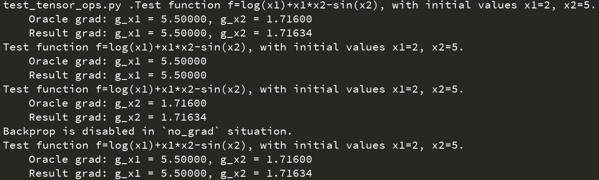

## 计算库实现探究

### 张量广播规律

张量计算过程中会有各种广播问题。由于自定义数据结构（``Zhangliang``）实际上是对``numpy.ndarray``的又一次封装，前馈过程的广播（``broadcast``）可由``numpy``内置运算确定，张量各维度需满足一定的关系才能完成广播。目前观察到张量在各个库（``numpy``，``tensorflow``和``pytorch``）内存在两类广播形式，我们这里分别称为"元素型"和"矩阵型"（下表中的``n``下标从1开始）：


可以看到不同的广播类型在反传时需要有不同的维度缩减策略。但事实上我们可以大致总结出不同广播类型需要满足的条件。

假定两个变量的大小分别为：$(a_1,a_2,...,a_m)$以及$(b_1,b_2,...,b_n)$。不失对称性，假定$n<m$。那么元素级运算的广播需满足：
$$
(a_1,a_2,...,a_m) \sim (\underbrace{1,1,...,1}_{n-m},b_1,b_2,...,b_n)
$$
也即，在广播时，``numpy``会尝试将维度较小的那个变量进行维度扩增（填充1），扩增至$m$。如果扩增后的两个维度互容，那么则允许广播。

类似的，矩阵型的广播条件为：
$$
\begin{align}
(a_1,a_2,...,a_m) &\sim (\underbrace{1,1,...,1}_{n-m},b_1,b_2,...b_{n-1},b_n) \\
\mathrm{s.t.}\quad& a_m = b_{n-1}
\end{align}
$$
确定了广播条件，我们就能在反传时确定输出梯度如何反馈到输入张量。我们举个例子说明反传时的维度缩减情况。

##### 元素级运算

假定两个矩阵$a$大小为$2\times 1$，$b$大小为$2\times 2$：
$$
\begin{equation}
a = \begin{bmatrix}
x_1 \\
x_2 
\end{bmatrix},\quad
b = \begin{bmatrix}
y_{11} & y_{12} \\
y_{21} & y_{22}
\end{bmatrix}
\end{equation}
$$
两者的四则运算为（以加法为例）：
$$
\begin{equation}
c=a\oplus b=\begin{bmatrix}
x_1 \\
x_2 
\end{bmatrix}\oplus
\begin{bmatrix}
y_{11} & y_{12} \\
y_{21} & y_{22}
\end{bmatrix}
=
\begin{bmatrix}
x_1+y_{11} & x_1+y_{12} \\
x_2+y_{21} & x_2+y_{22}
\end{bmatrix}
=
\begin{bmatrix}
\tilde{y}_{11} & \tilde{y}_{12} \\
\tilde{y}_{21} & \tilde{y}_{22}
\end{bmatrix}
\end{equation}
$$
输出大小为$2\times 2$。在反向传播时，损失值传到变量$c$应该同样为$2\times 2$大小。那么传回变量$a$和$b$时：
$$
\begin{align}
\frac{\partial l}{\partial x_1}&=\frac{\partial l}{\partial \tilde{y}_{11}}\frac{\partial \tilde{y}_{11}}{\partial x_1}+\frac{\partial l}{\partial \tilde{y}_{12}}\frac{\partial \tilde{y}_{12}}{\partial x_1}=\frac{\partial l}{\partial \tilde{y}_{11}}+\frac{\partial l}{\partial \tilde{y}_{12}} \\
\frac{\partial l}{\partial y_{11}}&=\frac{\partial l}{\partial \tilde{y}_{11}}\frac{\partial \tilde{y}_{11}}{\partial y_{11}}=\frac{\partial l}{\partial \tilde{y}_{11}}
\end{align}
$$
记上层传播到张量$c$的Jacobian为：
$$
\begin{equation}
\nabla_cl=\begin{bmatrix}
\dfrac{\partial l}{\partial \tilde{y}_{11}} & \dfrac{\partial l}{\partial \tilde{y}_{12}}\\
\dfrac{\partial l}{\partial \tilde{y}_{21}} & \dfrac{\partial l}{\partial \tilde{y}_{22}}
\end{bmatrix}
\end{equation}
$$
那么：
$$
\begin{align}
\nabla_al&=\mathrm{ReducedSum}(\nabla_cl,dim=1)  \\
\nabla_bl&=\nabla_cl
\end{align}
$$
元素乘法类似：
$$
\begin{equation}
c=a+b=\begin{bmatrix}
x_1 \\
x_2 
\end{bmatrix}\otimes
\begin{bmatrix}
y_{11} & y_{12} \\
y_{21} & y_{22}
\end{bmatrix}
=
\begin{bmatrix}
x_1y_{11} & x_1y_{12} \\
x_2y_{21} & x_2y_{22}
\end{bmatrix}
=
\begin{bmatrix}
\tilde{y}_{11} & \tilde{y}_{12} \\
\tilde{y}_{21} & \tilde{y}_{22}
\end{bmatrix}
\end{equation}
$$

$$
\begin{align}
\frac{\partial l}{\partial x_1}&=\frac{\partial l}{\partial \tilde{y}_{11}}\frac{\partial \tilde{y}_{11}}{\partial x_1}+\frac{\partial l}{\partial \tilde{y}_{12}}\frac{\partial \tilde{y}_{12}}{\partial x_1}=\frac{\partial l}{\partial \tilde{y}_{11}}y_{11}+\frac{\partial l}{\partial \tilde{y}_{12}}y_{12} \\
\frac{\partial l}{\partial y_{11}}&=\frac{\partial l}{\partial \tilde{y}_{11}}\frac{\partial \tilde{y}_{11}}{\partial y_{11}}=\frac{\partial l}{\partial \tilde{y}_{11}}x_1
\end{align}
$$

所以：
$$
\begin{align}
\nabla_al&=\mathrm{ReducedSum}(\nabla_cl\otimes b,dim=1)  \\
\nabla_bl&=\nabla_cl\otimes a
\end{align}
$$


这里的``dim``参数序号从0开始。

##### 矩阵级运算

假定两个矩阵，$a$大小为$2\times 1$，$b$大小为$4\times 1\times 3$：
$$
\begin{equation}
a = \begin{bmatrix}
x_1 \\
x_2 
\end{bmatrix},\quad
b = \begin{bmatrix}
\begin{bmatrix}
y_{11} & y_{12} & y_{13}
\end{bmatrix}\\
\begin{bmatrix}
y_{21} & y_{22} & y_{23}
\end{bmatrix}\\
\begin{bmatrix}
y_{31} & y_{32} & y_{33}
\end{bmatrix}\\
\begin{bmatrix}
y_{41} & y_{42} & y_{43}
\end{bmatrix}\\
\end{bmatrix}
\end{equation}
$$
由于矩阵乘法实际参与运算的维度是最后两维，所以两者的矩阵乘结果为$4\times2\times3$大小：
$$
\begin{equation}
\begin{split}
c&=a\times b=\begin{bmatrix}
x_1 \\
x_2 
\end{bmatrix}\times
\begin{bmatrix}
\begin{bmatrix}
y_{11} & y_{12} & y_{13}
\end{bmatrix}\\
\begin{bmatrix}
y_{21} & y_{22} & y_{23}
\end{bmatrix}\\
\begin{bmatrix}
y_{31} & y_{32} & y_{33}
\end{bmatrix}\\
\begin{bmatrix}
y_{41} & y_{42} & y_{43}
\end{bmatrix}\\
\end{bmatrix}
\\
&=
\begin{bmatrix}
\begin{bmatrix}
x_1y_{11} & x_1y_{12} & x_1y_{13} \\
x_2y_{11} & x_2y_{12} & x_2y_{13}
\end{bmatrix}\\
\begin{bmatrix}
x_1y_{21} & x_1y_{22} & x_1y_{23} \\
x_2y_{21} & x_2y_{22} & x_2y_{23}
\end{bmatrix}\\
\begin{bmatrix}
x_1y_{31} & x_1y_{32} & x_1y_{33} \\
x_2y_{31} & x_2y_{32} & x_2y_{33}
\end{bmatrix}\\
\begin{bmatrix}
x_1y_{41} & x_1y_{42} & x_1y_{43} \\
x_2y_{41} & x_2y_{42} & x_2y_{43}
\end{bmatrix}\\
\end{bmatrix}
=
\begin{bmatrix}
\begin{bmatrix}
z_{111} & z_{112} & z_{113} \\
z_{211} & z_{212} & z_{213}
\end{bmatrix}\\
\begin{bmatrix}
z_{121} & z_{122} & z_{123} \\
z_{221} & z_{222} & z_{223}
\end{bmatrix}\\
\begin{bmatrix}
z_{131} & z_{132} & z_{133} \\
z_{231} & z_{232} & z_{233}
\end{bmatrix}\\
\begin{bmatrix}
z_{141} & z_{142} & z_{143} \\
z_{241} & z_{242} & z_{243}
\end{bmatrix}\\
\end{bmatrix}
\end{split}
\end{equation}
$$
于是不难得到：
$$
\begin{align}
\frac{\partial l}{\partial x_1}&=\sum_{i=1}^4\sum_{j=1}^3\frac{\partial l}{\partial z_{1ij}}\frac{\partial z_{1ij}}{\partial x_1}=\sum_{i=1}^4\sum_{j=1}^3\frac{\partial l}{\partial z_{1ij}}y_{ij} \\
\frac{\partial l}{\partial y_{11}}&=\sum_{i=1}^2\frac{\partial l}{\partial z_{i11}}\frac{\partial z_{i11}}{\partial y_{11}}=\sum_{i=1}^2\frac{\partial l}{\partial z_{i11}}x_i
\end{align}
$$
因此，类似的，如果记：
$$
\begin{equation}
\nabla_cl=\begin{bmatrix}
\dfrac{\partial l}{\partial z_{ijk}}
\end{bmatrix}
_{4\times2\times3}
\end{equation}
$$
那么反传时的梯度为：
$$
\begin{equation}
\begin{split}
\nabla_al&=\mathrm{ReducedSum}(\nabla_cl\times b^T, dim=0) \\
\nabla_bl&=a^T\times\nabla_cl
\end{split}
\end{equation}
$$
这里的转置是对张量最后两个维度进行转换。

从上述的例子中可以发现，我们需要根据输入张量和输出张量之间的维度差别，从而找出对每个输入应该如何变换其数据形状才能计算出其对应的梯度。

##### 部分不可导函数的微分近似

| 函数                    | 近似微分 |
| ----------------------- | -------- |
| ``abs``                 |          |
| ``max``/``min``         |          |
| ``maximum``/``minimum`` |          |

##### 浮点数精度问题

在编写测试脚本时发现一个问题：``np.float32``精度比较低，经常导致测试通不过。改成``np.float64``稍微好一点。但是实际使用时，神经网络其实可以允许一定的截断误差，而且这些截断误差可能有利于网络的训练（比如跳出局部最优点）。因此，测试时使用``np.float64``，而实际使用时``np.float32``即可。

### 算子实现

这一节探讨下各种算子的实现问题，也会简单分析下各种算子的梯度计算问题。梯度计算这一过程，事实上大部分都能在网上找到计算公式，但是自己实现过程中还是需要推导一下，这一过程中也能更好地理解其工程考虑。

#### Sigmoid算子

假定输入为$x$（可以是标量或者张量），那么输出为：
$$
\begin{align}\label{eq:sigmoid positive}
z_i =\dfrac{1}{1+e^{-x_i}}
\end{align}
$$
记$y_i=e^{x_i}$，那么：
$$
\begin{align}
z_i =\dfrac{y_i}{1+y_i}
\end{align}
$$
于是有：
$$
\begin{align}
\dfrac{\partial z_i}{\partial x_i}&=\dfrac{\partial z_i}{\partial y_i}\dfrac{\partial y_i}{\partial x_i}\\
&=\dfrac{1+y_i-y_i}{(1+y_i)^2}e^{x_i}\\
&=\dfrac{1}{(1+y_i)^2}y_i\\
&=\dfrac{1}{1+y_i}\dfrac{y_i}{1+y_i}\\
&=(1-z_i)z_i
\end{align}
$$
具体实现还有一点需要考虑：式$\eqref{eq:sigmoid positive}$适用于$x$为正的情况，当$x$为负且绝对数值较大时，$e^{-x}$会造成数值溢出，此时较好的实现应该是：
$$
\begin{align}
z=\dfrac{e^x}{1+e^x}
\end{align}
$$
因此，需要根据$x$内每个点的数值情况分别使用不同的计算方法，以保证不会溢出。

#### Softmax算子

同样假定输入为$x$，那么输出为：
$$
\begin{align}
z_i =\dfrac{e^{x_i}}{\sum_{j}e^{x_j}}
\end{align}
$$
记$y_i=e^{x_i}$，那么：
$$
\begin{align}
z_i =\dfrac{y_i}{\sum_j y_j}
\end{align}
$$
于是$j\ne i$时，$\dfrac{\partial y_j}{\partial x_i}=0$，有：
$$
\begin{equation}
\begin{split}
\dfrac{\partial z_i}{\partial x_i}&=\sum_j\dfrac{\partial z_i}{\partial y_j}\dfrac{\partial y_j}{\partial x_i}\\
&=\dfrac{\partial z_i}{\partial y_i}\dfrac{\partial y_i}{\partial x_i}\\
&=\dfrac{\sum_j y_j-y_i}{(\sum_jy_j)^2}e^{x_i}\\
&=\left(\dfrac{1}{\sum_jy_j}-\dfrac{y_i}{(\sum_jy_j)^2}\right)y_i\\
&=\dfrac{y_i}{\sum_jy_j}-\left(\dfrac{y_i}{\sum_jy_j}\right)^2\\
&=(1-z_i)z_i
\end{split}\end{equation}
$$
``softmax``算子同样有溢出的问题，但是比较好处理。一个通常的方法是找出对应维度的最大值，然后减去这个最大值，保证$e^x$中的$x$小于0：
$$
\begin{align}
\tilde{x}&=x-\max(x,dim)\\
z&=\dfrac{e^{\tilde{x}}}{\mathrm{ReduceSum}(e^{\tilde{x}},dim)}
\end{align}
$$

### 卷积算子

参考资料：

- [FAST CONVOLUTIONAL NETS WITH fbfft : A GPU PERFORMANCE EVALUATION](https://research.fb.com/wp-content/uploads/2016/11/fast-convolutional-nets-with-fbfft-a-gpu-performance-evaluation.pdf?)
- [Fast Algorithms for Convolutional Neural Networks](https://arxiv.org/pdf/1509.09308.pdf)
- [Leonardo的博客](https://leonardoaraujosantos.gitbooks.io/artificial-inteligence/content/making_faster.html)
- [Sahnimanas的博客](https://sahnimanas.github.io/post/anatomy-of-a-high-performance-convolution/)
- [Jonathan Ragan-Kelley的博士论文](http://people.csail.mit.edu/jrk/jrkthesis.pdf)
- [贾扬清的备忘录](https://github.com/Yangqing/caffe/wiki/Convolution-in-Caffe:-a-memo)

卷积作为现代神经网络中最重要的算子，其实现需要特定的优化。卷积过程本质上仍可看成是对图像每个局部区域内的信息进行矩阵乘法，因此实现卷积算子时力求将这一个过程进行加速和优化。这其中又涉及到算法具体实现时的各种问题，计算调度、缓存调度、并行计算等（事实上其他算子也有这些问题，只是在卷积算子中这些问题更加突出）。由于笔者能力有限，暂时未完成这一部分。

目前各大框架对卷积的实现有四种方法：

- 直接计算
- 通过``im2col``方法，将卷积完全转化为两个矩阵的乘法
- 通过``FFT``进行计算
- 通过``winograd``方法

#### 直接计算


朴素计算方法比较直观，给定一个$cin$通道数的特征图/图像，一个卷积核对每个通道内的数据进行滑动窗口内元素乘法加和运算，如此生成一个$cin$通道的中间特征图，再将各通道数据进行求和获得最终的输出。这种运算可以用于$cout$个不同的卷积核同时进行运算，最终形成$cout$通道的输出特征图。
很明显，朴素计算方法没有任何的优化，假定输入特征图大小为$S\times n\times n\times f$，卷积核大小$f'\times f\times k\times k$，步长$1$，没有$padding=1$，输出特征图大小为$S\times n\times n\times f'$，实际上乘法执行次数为$Sff'n^2k^2$，加法执行次数为$Sff'n^2k^2$。我们知道计算机里面乘法的运算时间比加法大很多。将“一次乘法+一次加法”称为一个“FLOP”，那么朴素计算所需的复杂度可表示为$O(Sff'n^2k^2)$ FLOPs。

#### 通过``im2col``方法


观察卷积运算过程，其实就是每个位置上的特征数据与对应位置的核参数进行相乘后，再对局部区域进行求和的操作，再对各通道求和，本质就可看成是矩阵/向量之间的乘法。所以``im2col``的思路就是将特征图局部和卷积核进行展开，处理成矩阵或向量来完成运算。这样展开成大矩阵，通过矩阵乘法对卷积运算进行加速。我们知道矩阵乘法已经有了加速的方法，因此卷积的效率可以进一步提高。上图中展示了一个具体过程。

#### 通过FFT进行计算

卷积过程顾名思义，来自于信号处理邻域。那么在信号处理中常用的傅里叶变换自然也可用于与实现卷积的计算，而且比朴素方法更加高效：


其中$\circ$是点对点乘积，$*$是共轭。相比于朴素算法的$O(Sff'n^2k^2)$复杂度，通过FFT计算卷积的复杂度只需要$O(Sff'n^2+(Sf+ff'+Sf')n^2\log n)$。基于FFT的卷积方法通常将空间维度$n$分解为若干个基础卷积算子的组合，比如$2\times2$，$3\times3$，$5\times5$，$7\times7$，计算这些组合的结果后再计算总的输出结果。如果$n$不能分解为这些质数卷积核的组合，那么就比$n$大且能分解为上述质数组合的最快的点数$n'$的卷积，然后再取对应的值。由于FFT的性质，在卷积核较小问题规模也较小时，基于FFT的卷积性能反而可能不如朴素方法；但随着问题规模的增大，或者卷积核较大时，基于FFT的卷积性能要远远好于朴素卷积方法，以及``im2col``方法。

#### 通过``winograd``方法

``Winograd``则是另一种优化思路，通过优化计算的流程来加快卷积过程。通常对于较小的卷积核，用winograd方法计算会比较快。

### 优化方法

参考资料：

- [Rprop](https://florian.github.io/rprop/)
- [Caffe Solver](http://caffe.berkeleyvision.org/tutorial/solver.html)
- [深度学习最全优化方法总结比较（SGD，Adagrad，Adadelta，Adam，Adamax，Nadam）](https://zhuanlan.zhihu.com/p/22252270)
- [Types of Optimization Algorithms used in Neural Networks and Ways to Optimize Gradient Descent](https://towardsdatascience.com/types-of-optimization-algorithms-used-in-neural-networks-and-ways-to-optimize-gradient-95ae5d39529f)
- [PyTorch与caffe中SGD算法实现的一点小区别](https://zhuanlan.zhihu.com/p/43016574)

常见的网络优化方法包括以下若干种：

| 方法                                                         | 优化规则                                                     | 备注                          |
| ------------------------------------------------------------ | ------------------------------------------------------------ | ----------------------------- |
| [Momentum SGD](https://www.microsoft.com/en-us/research/wp-content/uploads/2012/01/tricks-2012.pdf) | $v_{t+1}=\mu v_t-\alpha\nabla L_{w}\\ w_{t+1}=w_t+v_{t+1}$   | $\mu$是动量，$\alpha$是学习率 |
| [AdaGrad](http://www.jmlr.org/papers/volume12/duchi11a/duchi11a.pdf) | $w_{t+1}=w_t-\dfrac{\alpha}{\sqrt{\sum_{\tau=1}^t(\nabla L_{w})^2_\tau}}\nabla L_w$ |                               |
| [AdaDelta](https://arxiv.org/pdf/1212.5701.pdf)              | $v_{t+1}=-\dfrac{RMS[v]_{t}}{RMS[g]_{t+1}}g_{t+1}\\w_{t+1}=w_t+v_{t+1}$ | RMS是root of mean squared     |
| [Adam](https://arxiv.org/pdf/1412.6980.pdf)                  | $m_t=\beta_1m_{t-1}+(1-\beta_1)\nabla L_w\\v_t=\beta_2v_{t-1}+(1-\beta_2)(\nabla L_w)^2\\w_{t+1}=w_t-\alpha\dfrac{\sqrt{1-\beta_2^t}}{1-\beta_1^t}\dfrac{m_t}{\sqrt{v_t}+\epsilon}$ | 自动矩估计                    |
| [Nesterov](http://www.cs.toronto.edu/~fritz/absps/momentum.pdf) | $v_{t+1}=\mu v_t-\alpha\nabla L_{w_t+\mu v_t}\\w_{t+1}=w_t+v_{t+1}$ |                               |
| [RMSprop](http://www.cs.toronto.edu/~tijmen/csc321/slides/lecture_slides_lec6.pdf) | $MS(w_t)=\delta MS(w_{t-1})+(1-\delta)\nabla L_{w}^2\\w_{t+1}=w_t-\alpha\dfrac{\nabla L_w}{\sqrt{MS(w_t)}}$ |                               |
| [Rprop](http://www.neuro.nigmatec.ru/materials/themeid_17/riedmiller93direct.pdf) | $v_{t+1}=-\alpha_{t+1}*sgn\left(\nabla L_w\right)\\w_{t+1}=w_{t}+v_{t+1}\\\alpha_{t+1}=\begin{cases}\min(\alpha_t*a,\alpha_{max}), ~if~\nabla_{w_{t+1}}L*\nabla_{w_t}L>0\\\max(\alpha_t*b,\alpha_{min}), ~if~\nabla_{w_{t+1}}L*\nabla_{w_t}L<0\\\alpha_t,~otherwise\end{cases}$ | $a>1>b$，典型值$a=1.2,~b=.5$  |

#### 随机梯度下降SGD

简单回顾下随机梯度下降方法。在没有解析解的情况下，我们知道优化一个函数往往是通过一些其他方法，其中梯度下降方法就是最重要的一种。其目的是从某个点开始，沿着当前点的负梯度方向逐步找到函数的极小值点。


对于机器学习任务，可能有大量数据用于学习$\{(x_1,y_1),(x_2,y_2),...,(x_N,y_N)\}$。学习时，一种方法就是每次都使用所有数据对模型参数进行调整：
$$
\begin{align}
\Delta w&=-\sum_{i=1}^N \nabla_w L(x_i,y_i) \\
w_{t+1}&=w_t + \alpha\Delta w
\end{align}
$$
若干次迭代优化达到收敛即可。当$N$较小时，上式方法仍比较高效；但随着$N$的逐渐增大，同时计算所有样本对这一过程成为了训练的瓶颈。无论是内存、显存或者算力，都无法支持如此大量数据同时进行训练和迭代；而逐批输入数据再汇总则具有巨大的时间开销，也是不可取的。因此随机梯度下降方法也就应运而生。它是对上式的一种极端简化：每次迭代只取一个样本计算梯度。
$$
\begin{align}
\Delta w&=-\nabla_w L(x_i, y_i)\\
w_{t+1}&=w_t + \alpha\Delta w
\end{align}
$$
而这个样本也是每次迭代随机选取的。由于SGD不知道每次使用的是什么数据，或者之前是否已使用过，这种随机性以及一个独立样本内包含的噪声干扰能够一定程度上提升模型的泛化能力。SGD的收敛性有Robbins-Siegmund定理保证，只需要满足$\sum_t\alpha_t^2<\infin$以及$\sum_t\alpha_t=\infin$。

但上述极端简化方法仍存在一个问题：样本噪声在提升鲁棒性和泛化性的同时，也使得SGD收敛得非常慢。所以在实现上，现代的SGD了吸收了两种极端情况的各自优点，将单例更新修改为了批数据更新：
$$
\begin{align}
\Delta w&=-\sum_{i=1}^B\nabla_w L(x_i, y_i)\\
w_{t+1}&=w_t + \alpha\Delta w
\end{align}
$$
其中$B$是批大小。基于批的SGD既提高了单例SGD的收敛速度，也保留了样本的随机性使得模型更具泛化性能。当然SGD本身又有可改进之处。

#### 二阶优化方法

在介绍SGD的各种改进方法之前，有必要介绍下二阶的优化方法。我们称普通的梯度下降方法是一阶的，因为它们只用到了损失函数$\mathcal{L}$对参数$w$的一阶导数。事实上，优化方法可以使用更高阶的信息，比如二阶优化方法（Newton法、拟Newton法等）用到了Hessian矩阵来调整演化的方向：
$$
\Delta w=-\dfrac{1}{|\mathrm{diag}(H_t)|+\mu}\nabla_wL
$$
通常，高阶优化方法比一阶方法具有更快的收敛速度，当然也是有代价的：需要计算$\mathcal{L}$对参数$w$的二阶导数（Hessian矩阵），这是一个时间复杂度和空间复杂度都很高的过程。

#### Momentum SGD （带动量的SGD）

SGD存在一个问题是会产生振荡，因此收敛更难更慢。动量方法是SGD最常用最有效的一种改进，其思想是增强梯度持续指向方向的演化速度，减缓梯度符号变化之处的演化进程。做到这两点只需要一个小小的改进：
$$
\begin{align}
\Delta w_{t+1}&=\rho\Delta w_{t}-\alpha\sum_{i=1}^B\nabla_w L(x_i, y_i)\label{eq:naive sgd A}\\
w_{t+1}&=w_t + \Delta w_{t+1}\label{eq:naive sgd B}
\end{align}
$$
其中$\rho\in[0,1]$是动量参数。通过引入动量$\rho$，梯度演化方法将受到历史演化方向的影响。在梯度主方向，演化速度会累计提升加速；而在异常点，新的梯度方向影响较小，也就避免了参数在某个点附近振荡，加速了优化过程。

这里需要提到一点，事实上根据FAIR的[论文](https://arxiv.org/pdf/1706.02677.pdf)，朴素的动量SGD的学习率不是立即生效的，因为学习率$\alpha$只是被应用在了新的梯度上；当$\alpha$发生变化时，动量方向仍旧保持为前一时刻的方向，并且需要很长时间才能调整到新的方向。所以``PyTorch``在实现优化器时，使用的不是$\eqref{eq:naive sgd A}$和$\eqref{eq:naive sgd B}$，而是调整为：
$$
\begin{align}
\Delta w_{t+1}&=\rho\Delta w_{t}-\sum_{i=1}^B\nabla_w L(x_i, y_i)\label{eq:fair sgd A}\\
w_{t+1}&=w_t + \alpha\Delta w_{t+1}\label{eq:fair sgd B}
\end{align}
$$
这样在$\alpha$改变时演化立即就能生效。这还带来一个额外的好处，就是在实施**权重衰减**时也能避免衰减项主导演化速度和方向。考察权重衰减项$\frac{\lambda}{2}||w||^2$，通常这一项是单独加入更新中的。按照式$\eqref{eq:naive sgd A}$，加入衰减后的权重更新变为：
$$
\begin{align}
\Delta w_{t+1}&=\rho\Delta w_{t}-\alpha\sum_{i=1}^B\nabla_w L(x_i, y_i)-\lambda w_t\label{eq:naive sgd 2A}\\
w_{t+1}&=w_t + \Delta w_{t+1}\label{eq:naive sgd 2B}
\end{align}
$$
那么在更新权重时，如果学习率很小，衰减项将占据主导地位从而影响收敛和网络性能。如果按照``PyTorch``的实现方法，加入衰减的权重更新则变为了：
$$
\begin{align}
\Delta w_{t+1}&=\rho\Delta w_{t}-\sum_{i=1}^B\nabla_w L(x_i, y_i)-\lambda w_t\\
w_{t+1}&=w_t + \alpha\Delta w_{t+1}\label{eq:fair sgd 2B}
\end{align}
$$
可以看到，在``PyTorch``版本的SGD中，衰减项对演化速度和方向的影响要小于原实现。

#### Nesterov Accelerated Gradient

Yurii Nesterov观察到动量方法的一个问题：动量SGD无法预见到极值点应该减小演化速度。当优化达到某个极值点时，优化速度应该减小并趋于0；而由于动量的存在，动量SGD需要很长时间才能减小演化速度，甚至错过极值点。Nesterov的解决方法简单直接：相比于计算当前参数的梯度，我们可以前瞻一步查看下一步参数的梯度方向。如果这个未来的梯度方向与当前方向是反向的，那么应该减小当前的演化速度：
$$
\begin{align}
\Delta w_{t+1}&=\rho\Delta w_{t}-\alpha\sum_{i=1}^B\nabla_{w+\rho\Delta w} L(x_i, y_i)\\
w_{t+1}&=w_t + \Delta w_{t+1}
\end{align}
$$
这一方法能够根据梯度大小和符号自适应调整演化速度。

#### Resilient Propagation (Rprop)

弹性反向传播基于一个有趣的发现：梯度下降优化过程很可能与梯度绝对数值大小无关，而与梯度的符号有关。为了说明这一点，定义一个函数$f$，然后相应地定义另外两个函数，都是对$f$赋予一个scale量：


第二、第三个图与原函数$f$相差一个尺度量。显然三者有一个相同的最优点，但是三个函数的各点的梯度绝对数值却也差了一个scale。于是，在不知道理论函数与实际函数的尺度情况下，确定演化步长$\alpha$是个比较困难的事情。基于梯度的绝对数值来确定学习率就可能导致优化过程无法收敛到极值点。``Rprop``方法提出使用梯度符号来进行优化，并且提出一种自适应学习率的方法来调整演化步长：
$$
\begin{align}
v_{t+1}&=-\alpha_{t+1}*sgn\left(\nabla L_w\right)\\
w_{t+1}&=w_{t}+v_{t+1}\\
\alpha_{t+1}&=\begin{cases}\min(\alpha_t*a,\alpha_{max}), ~if~\nabla_{w_{t+1}}L*\nabla_{w_t}L>0\\\max(\alpha_t*b,\alpha_{min}), ~if~\nabla_{w_{t+1}}L*\nabla_{w_t}L<0\\\alpha_t,~otherwise\end{cases}
\end{align}
$$
``Rprop``的另一个优点是，能够根据每个参数梯度的数值大小自适应调整参数的学习率。换言之，由于量级不同，我们可能很难找到一个全局的学习率适合于所有参数，但是``Rprop``使得每个不同的参数都具有自己的学习率，这就能够克服梯度量级不同的问题。当然``Rprop``也有自己的缺陷，比如``Rprop``只适用于大批次数据，而对小批次数据不太适合。这是因为不同批次数据的梯度符号可能会不同，小批次数据的梯度符号变动较频繁，导致``Rprop``学习无法收敛。

#### RMSprop

正因为``Rprop``无法用于小批次数据，Tieleman提出了``RMSprop``将``Rprop``的思想应用于小批次数据。其想法也很简单：``Rprop``对每个batch都会除以一个不同的数，那么为什么不对相邻mini-batch除以不同的scale呢（并且每批次的scale只是略有不同）？实现这个思想的方法也很简单，只需要维护一个浮动的统计数据：
$$
\begin{align}
MS(w_t)&=\delta MS(w_{t-1})+(1-\delta)\nabla L_{w}^2\\
w_{t+1}&=w_t-\alpha\dfrac{\nabla L_w}{\sqrt{MS(w_t)}}
\end{align}
$$
其中$\delta$默认取$0.9$（Tieleman论文）或者$0.99$（Caffe默认）

#### AdaGrad

``AdaGrad``是另一种自适应学习率的方法。类似与``RMSprop``，其梯度被除以了一个尺度量：
$$
\begin{align}
MS(w_t)&=MS(w_{t-1})+(\nabla L_{w})^2\\
w_{t+1}&=w_t-\alpha\dfrac{\nabla L_w}{\sqrt{MS(w_t)}}
\end{align}
$$
注意到第一式与``RMSprop``中略有不同。在``RMSprop``中，浮动量$MS(w_t)$是由手动设定的数值$\delta$控制更新的，为固定值；而``AdaGrad``中是按照迭代次数$t$进行累计。这么做也有一个额外的优点，即学习率自主地随着时间减小，类似于退火技术。但是这也带来几个问题：

- ``AdaGrad``方法对于初始值比较敏感。比如，初始值具有较大的梯度值，那么后续所有的学习率实际上都被缩小了，造成学习缓慢；如果选择手动增大初始学习率，这反而又造成``AdaGrad``方法对初始学习率敏感了。
- 学习率将随着训练过程的进行一直减小，直到无法再学习。

#### AdaDelta

``AdaDelta``着重针对``AdaGrad``的上述两个缺点，做了两点改进：

- 将梯度平方累计过程改为在一个窗口的时间；
- 一阶方法忽略了数值单位，所以使用近似二阶数据来弥补

事实上第一点与``RMSprop``的表达式是一致的，即：
$$
\begin{align}
E[g^2]_t&=\rho E[g^2]_{t-1}+(1-\rho)g^2_t\\
RMS[g]_t&=\sqrt{E[g^2]_t+\varepsilon}\\
v_{t}&=-\dfrac{\alpha}{RMS[g]_t}g_t
\end{align}
$$
其中$g_t=\nabla_{w_t}L$为$t$时刻的梯度。第二点，在一阶优化方法中，梯度和参数的度量单位都是被忽略的，都是有问题的：
$$
\mathrm{units~of}~\Delta w\propto\mathrm{units~of}~\nabla_wL\propto\dfrac{\partial\mathcal{L}}{\partial w}\propto\dfrac{1}{\mathrm{units~of}~x}
$$
相比之下二阶方法则保证了度量单位的统一：
$$
\mathrm{units~of~}\Delta w\propto H^{-1}\nabla_wL\propto\dfrac{\frac{\partial\mathcal{L}}{\partial w}}{\frac{\partial^2\mathcal{L}}{\partial w^2}}\propto\mathrm{units~of~}x
$$
可以看到，一阶方法和二阶方法在度量单位上相差了两级。而由于：
$$
\Delta w=\dfrac{\frac{\partial\mathcal{L}}{\partial w}}{\frac{\partial^2\mathcal{L}}{\partial w^2}}\Rightarrow\dfrac{1}{\frac{\partial^2\mathcal{L}}{\partial w^2}}=\dfrac{\Delta w}{\frac{\partial\mathcal{L}}{\partial w}}
$$
我们只需要在现有梯度更新的过程中加入类似于二阶导数倒数的scale即可：
$$
\begin{align}
v_{t+1}&=-\dfrac{RMS[v]_t}{RMS[g]_{t+1}}g_{t+1}\\
w_{t+1}&=w_t+v_{t+1}
\end{align}
$$

#### Adaptive Moments Esimation (Adam)

``Adam``方法集合了``AdaGrad``的优点（较适用于稀疏梯度）与``RMSprop``的优点，具有诸多优点：

- 对于梯度的赋值不敏感
- 演化步长由超参数控制
- 不需要稳态优化目标
- 能够适用于稀疏梯度
- 自动步长退火

``Adam``方法也很简单：直接用浮动数据（running average）来拟合和估计一阶矩和二阶矩，然后计算梯度方向：
$$
\begin{align}
m_t&=\beta_1m_{t-1}+(1-\beta_1)g_t\\
v_t&=\beta_2v_{t-1}+(1-\beta_2)g_t^2\\
w_{t+1}&=w_t-\alpha\dfrac{\sqrt{1-\beta_2^t}}{1-\beta_1^t}\dfrac{m_t}{\sqrt{v_t}+\epsilon}
\end{align}
$$
这一形式与``RMSprop``的动量版本非常相似。不同之处在于，``RMSprop``的动量版本是依靠梯度的幅值来调整动量，而``Adam``则是直接维护和估计了梯度的二阶矩；另外``RMSprop``缺少有偏修正量（bias-correction term），在稀疏梯度的应用中会造成较大步长而使得优化过程发散。

#### AdaMax

``AdaMax``是``Adam``的一个变体。``Adam``实际上在梯度更新时使用了一个``L2``范数进行scale，这可以推广到$Lp$范数。而当$p\rightarrow\infin$时就得到了：
$$
\begin{align}
m_t&=\beta_1m_{t-1}+(1-\beta_1)g_t\\
u_t&=\lim_{p\rightarrow\infin}(v_t)^{1/p}=\max(\beta_2\cdot u_{t-1},|g_t|)\\
w_{t+1}&=w_t-\alpha\dfrac{1}{1-\beta_1^t}\dfrac{m_t}{u_t+\epsilon}
\end{align}
$$

## 数据集类和加载器

``Dataset``类及其加载器``DataLoader``类也是框架的必需。这两个类配合上各种管道类型的数据增广算子，以及多线程/多进程加载，能够为深度模型及时提供训练测试所需数据。这一流程的逻辑大约可以描述为：


其中``transform``执行的位置也可移到``DataLoader``后，比如``PyTorch``是将``transform``应用在了``Dataset``类加载数据的过程中，可能是因为``transform``用到了``Pillow.Image``只能处理单张图像；而``tensorflow``貌似将``transform``的``pipeline``应用到了``DataLoader``之后。

上述各部分的作用分别为：

- ``Files``：为输入数据所在文件路径
- ``Dataset``：根据文件路径加载单个文件样本
- ``transform``：对输入数据进行增广、归一化等
- ``DataLoader``：按照一定的组批方式，加载一批次若干数据，每批次数据的组合方式包括顺序组批、随机组批或者特定方式组批
- ``iteration``：``DataLoader``将使用迭代器、生成器的模式减少对内存的需求；速度由多线程/多进程保证
- ``Batchd Data``：成批的数据

综上，为了实现数据集的加载，我们需要实现``Dataset``类、``transform``方法、``Sampler``采样类、``DataLoader``加载类以及对应的单进程/多进程加载函数；另外如何便捷地加载每批次数据也是需要考虑地问题，比如``PyTorch``自动将迭代器应用到了``DataLoader``类的``__iter__``方法中，因此我们能够使用

```python
for batch_id, d in enumerate(some_data_loader):
    # pass
```

的方式加载数据（而且每次调用``DataLoader``的迭代都会新生成一个迭代器）；而``tensorflow``则使用了显式调用迭代器的方法：

```python
batch_size = 2
data = tf.data.Dataset.from_tensor(data_numpy)
data = data.batch(batch_size)
iter = data.make_one_shot_iterator()
with tf.Session()  as sess:
    # pass
```

## 其他知识

### hook技术

参考资料：

- [PyTorch 学习笔记（六）：PyTorch hook 和关于 PyTorch backward 过程的理解](https://www.pytorchtutorial.com/pytorch-note6-pytorch-hook-and-pytorch-backward/)
- [pytorch中的钩子（Hook）有何作用？](https://www.zhihu.com/question/61044004/answer/183682138)

``PyTorch``使用了一种hook方法来捕捉模型在前馈和反馈时的中间数据。由于AD的设计，调用损失的backward方法后各结点的梯度逐个计算完成并释放计算图，所以无法通过模型来获得中间结果的一些数据，所以使用了**钩子**（hook）技术来抓取这些数据保存到一个新的变量中。

``PyTorch``中有四种钩子：

- [torch.tensor.register_hook(self, hook)](https://github.com/pytorch/pytorch/blob/0ffda97aa4bacc1b00bf93d5d2bf25d46601ae17/torch/tensor.py#L120)
  - 用于``tensor``；
  - 在每次计算完``tensor``的梯度时都会调用其中的钩子；
  - 不能修改数据，只能获得一个新的变量用于保存新的梯度（通过``tensor.grad``获取）；
  - 钩子签名必须为：``hook(grad) -> Tensor or None``。
- [torch.nn.Module.register_forward_pre_hook(self, hook)](https://github.com/pytorch/pytorch/blob/0ffda97aa4bacc1b00bf93d5d2bf25d46601ae17/torch/nn/modules/module.py#L459)
  - 用于``Module``；
  - 在每次调用``forward``函数**前**都会调用其中的钩子，主要用于各类``Norm``模块/层；
  - 可以修改输入数据；
  - 钩子签名必须为：``hook(module, input) -> None or modified input``
- [torch.nn.Module.register_forward_hook(self, hook)](https://github.com/pytorch/pytorch/blob/0ffda97aa4bacc1b00bf93d5d2bf25d46601ae17/torch/nn/modules/module.py#L480)
  - 用于``Module``；
  - 在每次调用``forward``函数后，``backward``之前都会调用其中的钩子；
  - 可以修改输出数据，也可以原址修改输入数据，但是不会影响前馈结果（因为执行在``forward``之后）；
  - 钩子签名必须为：``hook(module, input, output) -> None or modified output``
- [torch.nn.Module.register_backward_hook(self, hook)](https://github.com/pytorch/pytorch/blob/0ffda97aa4bacc1b00bf93d5d2bf25d46601ae17/torch/nn/modules/module.py#L426)
  - 用于``Module``；
  - 在每次计算完输入数据的梯度后都会调用其中的钩子；
  - 不能修改数据，但是可以返回一个新变量包含其中的梯度数据（通过``Module.grad_input``获取）；
  - 钩子签名必须为：``hook(module, grad_input, grad_output) -> Tensor or None``；其中``grad_input``和``grad_output``可以是``tuple``。

我们举个例子来说明各种钩子的作用。首先，定义一个简单的模块，其中包含一个大小为``3x1``的参数：

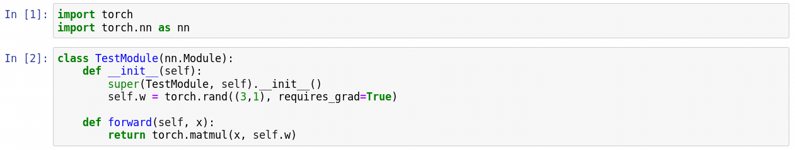

随后我们定义三个钩子函数，分别用于``tensor.register_hook``，``Module.register_forward_hook``和``Module.register_backward_hook``，并且读取相应的数据：

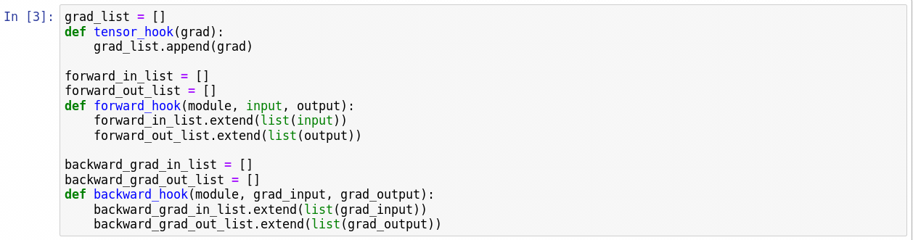

我们定义运算引入中间变量``y``：


先来观察下各个数据：

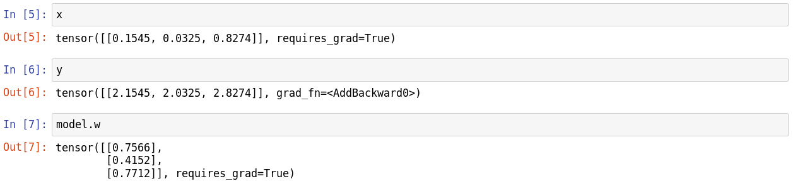

注册钩子：

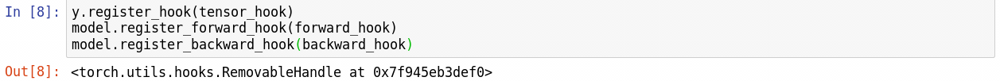

然后我们调用模块，并反传：

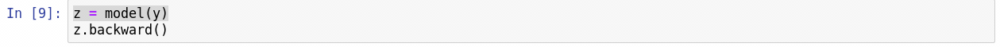

来看下``y.grad``，发现是``NoneType``：

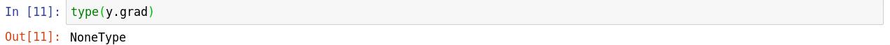

但是``y``的钩子函数捕捉到了数据，放在了``grad_list``这个列表中。各钩子捕捉到的数据：

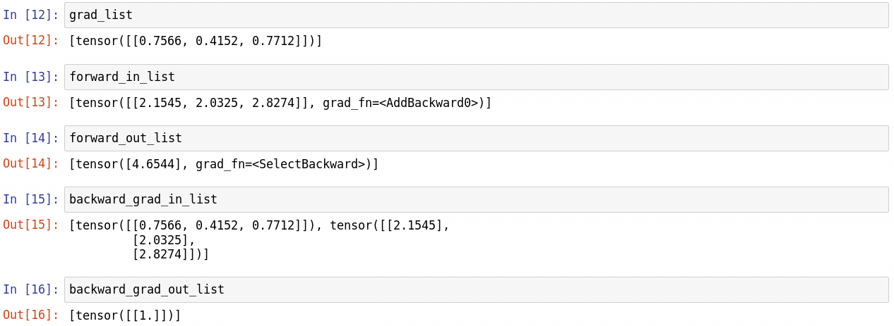

由此可以看到，通过对不同阶段的数据使用钩子，我们可以容易得获得中间变量/模块的数值/梯度等数据，并在其他任务中进行分析和处理。

个人认为钩子函数主要适用于对中间变量、特征图的数值和梯度的提取，这在对抗样本、迁移学习等邻域可能较为常用。而对于``torch.tensor``定义的变量（比如上例中的``x``）和模块参数（上例中的``model.w``），无需使用钩子技术。

## 待补充

- 卷积算子相关
  - 基于FFT的卷积
  - 基于winograd的卷积
  - 高速卷积的实现，C++，CUDA
- Dataloader相关
  - 多线程，多进程
  - PyTorch: [torch.utils.data.Dataset](https://github.com/pytorch/pytorch/blob/8f50ea0f5ce97956e0a313706d2d3466ee8c45fa/torch/utils/data/dataset.py#L8) -> [torch.utils.data.DataLoader](https://github.com/pytorch/pytorch/blob/8f50ea0f5ce97956e0a313706d2d3466ee8c45fa/torch/utils/data/dataloader.py#L60) -> [torch.utils.data.DataIterator](https://github.com/pytorch/pytorch/blob/8f50ea0f5ce97956e0a313706d2d3466ee8c45fa/torch/utils/data/dataloader.py#L300), 数据增广位于Dataset类内
  - tensorflow: [tf.data.Dataset](https://github.com/tensorflow/tensorflow/blob/8277db12ecd8ca92d77a20340dd3b2a7156d8992/tensorflow/python/data/ops/dataset_ops.py#L107) -> Dataset类自带的各种pipe操作，数据增广位于pipe内
  - MxNet: [mxnet.gluon.data.Dataset](http://mxnet.incubator.apache.org/_modules/mxnet/gluon/data/dataset.html#Dataset) -> [mxnet.gluon.data.DataLoader](http://mxnet.incubator.apache.org/_modules/mxnet/gluon/data/dataloader.html#DataLoader)，数据增广位于Dataset后
- 其他算子
- 内存管理
- 通信

## 资源

| 内容         | 网址                     | 备注               |
| ------------ | ------------------------ | ------------------ |
| 自动微分社区 | http://www.autodiff.org/ | 有关自动微分的内容 |


