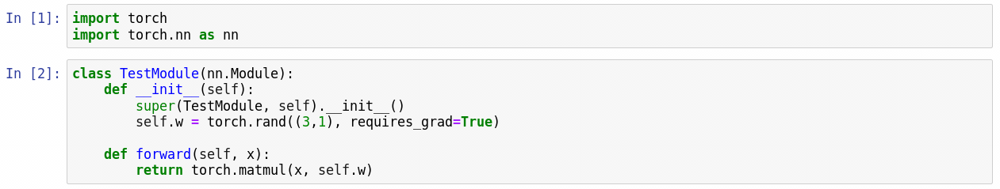
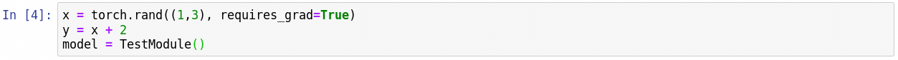

## 其他知识

[TOC]

### hook技术

参考资料：

- [PyTorch 学习笔记（六）：PyTorch hook 和关于 PyTorch backward 过程的理解](https://www.pytorchtutorial.com/pytorch-note6-pytorch-hook-and-pytorch-backward/)
- [pytorch中的钩子（Hook）有何作用？](https://www.zhihu.com/question/61044004/answer/183682138)

``PyTorch``使用了一种hook方法来捕捉模型在前馈和反馈时的中间数据。由于AD的设计，调用损失的backward方法后各结点的梯度逐个计算完成并释放计算图，所以无法通过模型来获得中间结果的一些数据，所以使用了**钩子**（hook）技术来抓取这些数据保存到一个新的变量中。

``PyTorch``中有四种钩子：

- [torch.tensor.register_hook(self, hook)](https://github.com/pytorch/pytorch/blob/0ffda97aa4bacc1b00bf93d5d2bf25d46601ae17/torch/tensor.py#L120)
  - 用于``tensor``；
  - 在每次计算完``tensor``的梯度时都会调用其中的钩子；
  - 不能修改数据，只能获得一个新的变量用于保存新的梯度（通过``tensor.grad``获取）；
  - 钩子签名必须为：``hook(grad) -> Tensor or None``。
- [torch.nn.Module.register_forward_pre_hook(self, hook)](https://github.com/pytorch/pytorch/blob/0ffda97aa4bacc1b00bf93d5d2bf25d46601ae17/torch/nn/modules/module.py#L459)
  - 用于``Module``；
  - 在每次调用``forward``函数**前**都会调用其中的钩子，主要用于各类``Norm``模块/层；
  - 可以修改输入数据；
  - 钩子签名必须为：``hook(module, input) -> None or modified input``
- [torch.nn.Module.register_forward_hook(self, hook)](https://github.com/pytorch/pytorch/blob/0ffda97aa4bacc1b00bf93d5d2bf25d46601ae17/torch/nn/modules/module.py#L480)
  - 用于``Module``；
  - 在每次调用``forward``函数后，``backward``之前都会调用其中的钩子；
  - 可以修改输出数据，也可以原址修改输入数据，但是不会影响前馈结果（因为执行在``forward``之后）；
  - 钩子签名必须为：``hook(module, input, output) -> None or modified output``
- [torch.nn.Module.register_backward_hook(self, hook)](https://github.com/pytorch/pytorch/blob/0ffda97aa4bacc1b00bf93d5d2bf25d46601ae17/torch/nn/modules/module.py#L426)
  - 用于``Module``；
  - 在每次计算完输入数据的梯度后都会调用其中的钩子；
  - 不能修改数据，但是可以返回一个新变量包含其中的梯度数据（通过``Module.grad_input``获取）；
  - 钩子签名必须为：``hook(module, grad_input, grad_output) -> Tensor or None``；其中``grad_input``和``grad_output``可以是``tuple``。

我们举个例子来说明各种钩子的作用。首先，定义一个简单的模块，其中包含一个大小为``3x1``的参数：

随后我们定义三个钩子函数，分别用于``tensor.register_hook``，``Module.register_forward_hook``和``Module.register_backward_hook``，并且读取相应的数据：

我们定义运算引入中间变量``y``：

先来观察下各个数据：

注册钩子：

然后我们调用模块，并反传：

来看下``y.grad``，发现是``NoneType``：

但是``y``的钩子函数捕捉到了数据，放在了``grad_list``这个列表中。各钩子捕捉到的数据：

由此可以看到，通过对不同阶段的数据使用钩子，我们可以容易得获得中间变量/模块的数值/梯度等数据，并在其他任务中进行分析和处理。

个人认为钩子函数主要适用于对中间变量、特征图的数值和梯度的提取，这在对抗样本、迁移学习等邻域可能较为常用。而对于``torch.tensor``定义的变量（比如上例中的``x``）和模块参数（上例中的``model.w``），无需使用钩子技术。