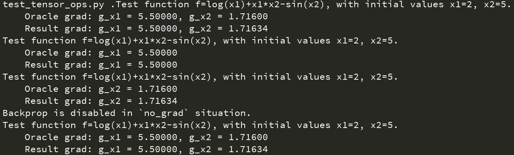

## 自动求导实现思路

[TOC]

我们可以基于基础算子方法和运算符重载方法，在``Python``下实现一个自动微分的库。首先我们需要自定义一种数据类（例如``Tensorflow``中的``Variable``和``PyTorch``中的``tensor``数据类），库内所有基础算子将对其进行运算，并支持反向传播过程。在此基础上，我们只需要实现对该数据类的基础算子定义和运算符重载即可。

### 基础数据类型

为了简单起见，我们先利用``numpy``的``ndarray``作为基础，将其封装一层即作为自定义数据类，并将其命名为``Zhangliang``（“张量”拼音）：

```python
class Zhangliang(BaseZhangliang):
    def __init__(self, data, dtype=np.float64, requires_grad=False):
        if isinstance(data, Zhangliang):
            data = data.values
        elif np.isscalar(data):
            data = [data]

        self._zhi = np.array(data, dtype=dtype)
        self.requires_grad = requires_grad
        self._tidu = np.zeros_like(self._zhi)

    def assign_value(self, new_value):
        self._zhi = new_value

    def update_grad(self, grad_value):
        self._tidu += grad_value

    @property
    def grad(self):
        if not self.requires_grad:
            raise AttributeError('Tensor requires no gradient.')
        else:
            return self._tidu

    @property
    def values(self):
        return self._zhi

    @property
    def shape(self):
        return self._zhi.shape

    @property
    def ndim(self):
        return self._zhi.ndim

    @property
    def dtype(self):
        return self._zhi.dtype

    @property
    def size(self):
        return self._zhi.size

    def __iter__(self):
        return self._zhi.__iter__()

    def __len__(self):
        return len(self._zhi)

    def __getitem__(self, item):
        return self._zhi[item]

    def __repr__(self):
        return self._zhi.__repr__()

    def __str__(self):
        return self._zhi.__str__()

    @classmethod
    def zeros(cls, shape, dtype=np.float64, requires_grad=False):
        zeros_ = np.zeros(shape, dtype=dtype)
        return cls(zeros_, requires_grad=requires_grad)

    @classmethod
    def ones(cls, shape, dtype=np.float64, requires_grad=False):
        ones_ = np.ones(shape, dtype=dtype)
        return cls(ones_, requires_grad=requires_grad)

    @classmethod
    def zeros_like(cls, data, dtype=np.float64, requires_grad=False):
        shape = data.shape
        zeros_ = np.zeros(shape, dtype=dtype)
        return cls(zeros_, requires_grad=requires_grad)

    @classmethod
    def ones_like(cls, data, dtype=np.float64, requires_grad=False):
        shape = data.shapes
        ones_ = np.ones(shape, dtype=dtype)
        return cls(ones_, requires_grad=requires_grad)

    @classmethod
    def array(cls, data, requires_grad=False):
        if isinstance(data, Zhangliang):
            return cls(data.values, dtype=data.dtype, requires_grad=requires_grad)
        elif np.isscalar(data):
            return cls([data], dtype=np.int32, requires_grad=requires_grad)
        elif isinstance(data, (list, tuple)):
            return cls(data, dtype=np.float64, requires_grad=requires_grad)
        elif isinstance(data, collections.Iterable):
            data = np.array(data)
            return cls(data, dtype=np.float64, requires_grad=requires_grad)
        else:
            raise TypeError

    @classmethod
    def linspace(cls, start, stop, num):
        data = np.linspace(start, stop, num)
        return cls(data, dtype=data.dtype, requires_grad=False)

    @classmethod
    def arange(cls, start, stop=None, step=1):
        if stop is None:
            stop = start
            start = 0
        data = np.arange(start, stop, step)
        return cls(data, dtype=data.dtype, requires_grad=False)
```

目前定义的``Zhangliang``类仅包括其值（``Zhangliang.zhi``，本质就是``numpy.ndarray``），以及一些基础函数，尚未包括运算符重载。回顾下``PyTorch``和``Tensorflow``中的数据类，它们都支持``a+b``形式的调用。这在``Python``中是遵循了协议接口，调用其数据类的``__add__``方法；另一方面，在``PyTorch``和``Tensorflow``我们还能看到``tf.add(a,b)``和``torch.add(a,b)``形式的调用，这说明两个框架也存在着独立的基础算子。综合这两点，实际上我们只需要实现独立的基础算子，然后在``Zhangliang.__add__``方法中调用``add``算子即可：

```python
# 定义基础算子，并重载运算符
# 这里只展示基础四则运算

class Zhangliang(object):
     # 省略上述已有内容

     def __add__(self, other):
        return zl_add(self, other)

     def __radd__(self, other):
        return zl_add(other, self)

     def __sub__(self, other):
        return zl_sub(self, other)

     def __rsub__(self, other):
        return zl_sub(other, self)

     def __truediv__(self, other):
        return zl_truediv(self, other)


def zl_add(a, b):
    if isinstance(a, numbers.Real):
        value = a + b.zhi
    elif isinstance(b, numbers.Real):
        value = a.zhi + b
    else:
        value = a.zhi + b.zhi
    return Zhangliang(value)


def zl_sub(a, b):
    if isinstance(a, numbers.Real):
        value = a - b.zhi
    elif isinstance(b, numbers.Real):
        value = a.zhi - b
    else:
        value = a.zhi - b.zhi
    return Zhangliang(value)


def zl_mul(a, b):
    if isinstance(a, numbers.Real):
        value = a * b.zhi
    elif isinstance(b, numbers.Real):
        value = a.zhi * b
    else:
        value = a.zhi * b.zhi
    return Zhangliang(value)


def zl_truediv(a, b):
    if isinstance(a, numbers.Real):
        value = a / b.zhi
    elif isinstance(b, numbers.Real):
        if b == 0:
            raise ValueError('0 cannot be divisor.')
        value = a.zhi / b
    else:
        value = a.zhi / b.zhi
    return Zhangliang(value)

# 省略以下
```

定义这些运算比较简单，甚至求对应的微分过程也比较容易实现。但问题是：

- **如何注册前向和反向运算？**
- **我们在编写前馈运算时，怎么跟踪和记录运算过程？**
- **为了确定反传的执行顺序，怎么通过上述跟踪记录来获得计算图？**
- **如何进行反传？**

### 第一个问题：如何注册前向和反向函数？

第一个问题相对而言比较简单：我们定义两个字典：

```python
forward_func = dict()
backward_func = dict()
```

然后前馈函数和反馈函数各自以``{算子名：前馈/反馈函数}``对的方式进行注册。我们通过``Python``装饰器来进行注册，为此，先定义两个注册机：

```python
def create_register(dict_):
    def register(key):
        def _(fn):
            dict_[key] = fn
            return fn
        return _
    return register

forward_func = {}
forward_register = create_register(forward_func)
backward_func = {}
backward_register = create_register(backward_func)
```

那么只需要在基础算子定义前加上装饰器即可完成注册，比如以下代码可以将``zl_add``函数注册到前馈函数库中并注册为``{'add': zl_add}``：

```python
@forward_register(key='add')
def zl_add(a, b):
    pass
```

### 第二个问题：如何跟踪和记录运算过程？

即使注册了函数，我们仍需要跟踪和记录前馈过程的运算过程。假设有一个跟踪机``tracer``，在每次调用基础算子时，都需要记录算子的``Zhangliang``输入和输出，以及算子自身的类型。这一需求同样可以通过装饰器来实现：

```python
# create_tracer将定义一个计算图`graph_`，具体类型稍后介绍
# trave_with_name则是真正的装饰器函数，将使用`op_name`来追踪被装饰函数
# wrap是对原函数的封装，传入为原函数引用
# eval_fn是真正执行原函数，并且在执行后将输入输出记录到计算图中

def create_tracer(graph_):
    def trace_with_name(op_name):
        def wrap(fn):
            def eval_fn(*args, **kwargs):
                output = fn(*args, **kwargs)
                
                # 将输入args和输出output记录到计算图graph_中
                # 也要记录算子的配置kwargs
                
                return output
            return eval_fn
        return wrap
    return trace_with_name

graph = {}
trace = create_tracer(graph)
```

将``trace``装饰器放在前馈函数前，就能在每次调用该函数时将输入和输出记录到计算图``graph_``中。

不过此时又出现了一个问题：前馈函数注册机``forward_func``和跟踪器``trace``两个装饰器有点不同，``forward_func``是在前馈函数定义时调用一次（只需要一次即可），而``trace``则是每次调用前馈函数时都要调用。连着使用两个装饰器会导致每次调用前馈函数时都注册一次；另外，两个有点麻烦，不如一个装饰器简便。基于上述理由，我们将``trace``修改为：

```python
def create_tracer(graph_: Graph):
    def trace_with_name(op_name):
        @forward_func(op_name=op_name)
        def wrap(fn):
            def eval_fn(*args, **kwargs):
                output = fn(*args, **kwargs)
                
                # 将输入args和输出output记录到计算图graph_中
                # 也要记录算子的配置kwargs
                
                return output
            return eval_fn
        return wrap
    return trace_with_name


graph = Graph()
trace = create_tracer(graph)
```

注意到第3行，``forward_func``装饰器现在装饰了原函数的封装函数``wrap``。这样在添加``trace``装饰器的时候，就会调用一次注册机，原函数即在装饰``trace``时完成了注册。

因此，剩下的目标就是如何定义计算图，以便在调用前馈函数时将各张量和算子记录下来。

### 第三个问题：怎么通过上述跟踪记录来获得计算图？

计算图中需要包括三类元素：

- 运算过程中的常量；
- 运算过程中的张量、中间变量；
- 运算过程中的算子。

一个基本的观察是：每个基础算子可能有若干个输入，但是只会有一个输出。所以每个算子都会绑定一个输出的中间变量/张量。我们定义一个节点类：

```python
# 节点类，每个节点对应一个算子，以及一个输出的中间变量
# input_list:        输入的`Zhangliang`
# input_list_id:     每个输入`Zhangliang`的id
# output:            输出的`Zhangliang`
# op_type: 			节点算子类型，对应于注册机内的关键字
# input_kwargs:      算子配置
# op_id:             节点编号
class Node(object):
    def __init__(self, input_args, input_kwargs, output, op_type):
        self.input_list = tuple(input_args)
        self.input_list_id = tuple([id(an_input) for an_input in self.input_list])
        self.output = output
        self.op_type = op_type
        self.input_kwargs = input_kwargs
        self.op_id = -1

    def set_id(self, id_value):
        self.op_id = id_value

    @property
    def name(self):
        if self.op_id < 0:
            raise ValueError('Node not added to graph.')
        node_name = '{}_{}'.format(self.op_type, self.op_id)
        return node_name
```

节点类将记录每个被追踪的算子的输入张量，输入参数，算子类型以及输出张量。通过张量的先后关系，我们再定义一个计算图类用于记录每个节点，并根据输入输出关系计算反传时的拓扑顺序。计算图类定义如下：

```python
"""
计算图类
成员变量：
  _op_count: 每种不同类型的算子的计数
  _nodes_by_name: 按照添加顺序排列的节点字典；会给每个节点一个名字；通过节点名进行索引
  _nodes_by_id: 按照输出Zhangliang的id对节点进行索引；在反传时用于找出对应的节点和算子
  _topo: 计算图的反向拓扑，每个节点映射到其父节点，通过节点名进行索引
成员函数：
  is_initialized: 反传时用于判断是否已经进行拓扑排序
  is_leaf: 判断某个Zhangliang所在节点是否为叶节点（即最终的输出）
  get_node_by_output_tensor：对外接口，获取Zhangliang对应的节点
  get_parents：对外接口，获取Zhangliang对应节点的父节点
  append_node: 添加节点，会为每个节点一个名字
  toposort: 按照拓扑顺序对节点进行排列
  clear_graph: 清除计算图
""" 

class Graph:
    def __init__(self):
        self._op_count = dict()
        self._nodes_by_name = OrderedDict()
        self._nodes_by_id = OrderedDict()
        self._topo = OrderedDict()

    def is_initialized(self):
        return len(self._topo) != 0

    def is_leaf(self, tensor):
        node = self.get_node_by_output_tensor(tensor)
        return list(self._topo.items())[0][0] == node.name

    def get_node_by_output_tensor(self, tensor):
        query_id = id(tensor)
        node = self._nodes_by_id[query_id]
        return node

    def get_parents(self, node):
        if not self.is_initialized():
            self.toposort()
        parent_name = self._topo[node.name]
        parent_nodes = [self._nodes_by_name[p] for p in parent_name]
        return parent_nodes

    def append_node(self, node: Node):
        node_type = node.op_type
        count = self._op_count.setdefault(node_type, 0)
        node.set_id(count)
        self._op_count[node_type] += 1

        # Index node by the op name
        self._nodes_by_name[node.name] = node

        # Index node by the output id
        self._nodes_by_id[id(node.output)] = node

    def toposort(self):
        for k, node_ in reversed(self._nodes_by_name.items()):
            parents = []
            for j, node_b in reversed(self._nodes_by_name.items()):
                output = node_b.output
                if id(output) in node_.input_list_id:
                    parents.append(j)
                if len(parents) == len(node_.input_list):
                    break
            self._topo[k] = parents

    def clear_graph(self):
        self._op_count.clear()
        self._nodes_by_name.clear()
        self._nodes_by_id.clear()
        self._topo.clear()
```

然后在``trace``中调用计算图：

```python
def create_tracer(graph_: Graph):
    def trace_with_name(op_name):
        @func_register(op_name=op_name)
        def wrap(fn):
            def eval_fn(*args, **kwargs):
                output = fn(*args, **kwargs)
                new_node = Node(input_args=args, input_kwargs=kwargs, output=output, op_type=op_name)
                graph_.append_node(new_node)
                return output
            return eval_fn
        return wrap
    return trace_with_name
```

至此，我们完成了自动微分的部分必需内容。

到此为止，在调用注册的函数执行张量运算时，计算图会将所有算子都记录下来，有时候比较不方便，比如类似``tensorflow``和``pytorch``都有只执行前馈不加入计算图的功能函数（``tensorflow``的``stop_gradient``函数和``pytorch``的``no_grad``上下文函数）；另外，如果我们编写一些算子函数可能也会需要这一功能（比如编写卷积层时可能会用到张量基本运算，但是将卷积这一过程都分解记录为张量的基础算子不是非常合适）。所以我们需要额外的一个功能，就是编写类似于``no_grad``的上下文函数。首先，为``Graph``计算图类添加一个**当前是否记入节点**的标志：

```python
class Graph:
    def __init__(self):
        # 省略了这部分内容
        self._ctx_requires_grad = True

    def is_grad_enabled(self):
        return self._ctx_requires_grad

    def set_grad_enable(self, enabled=True):
        self._ctx_requires_grad = enabled

    # 省略了其他函数
```

然后编写上下文函数（参考``pytorch``的``no_grad``函数）：

```python
class no_grad(object):
    def __init__(self):
        self.prev_state = graph.is_grad_enabled()

    def __enter__(self):
        self.prev_state = graph.is_grad_enabled()
        graph.set_grad_enable(False)

    def __exit__(self, exc_type, exc_val, exc_tb):
        graph.set_grad_enable(self.prev_state)
        return False


class has_grad(object):
    def __init__(self):
        self.prev_state = graph.is_grad_enabled()

    def __enter__(self):
        self.prev_state = graph.is_grad_enabled()
        graph.set_grad_enable(True)

    def __exit__(self, exc_type, exc_val, exc_tb):
        graph.set_grad_enable(self.prev_state)
        return False
```

### 第四个问题：如何进行反传？

假定我们已经获得了所有算子节点的拓扑顺序，也编写了每个算子反传函数，那么如何完成计算图的反传？实际上，在深度学习语境下，所有计算图最终只有一个输出节点，即``loss``。这是唯一的一个叶节点，从这个叶节点开始，根据拓扑顺序，我们可以依次使用反向模式进行传播。所以这也是计算图``Graph``类会有一个``is_leaf``函数的原因，叶节点总是位于反向拓扑的第一个位置。

调用形式上，``pytorch``使用了``tensor.backward()``的形式，即只需调用最终输出节点的反传函数，便可对整个计算图中的节点进行反传。我们模仿这一调用形式，并在``Zhangliang``类中进行实现：

```python
class Zhangliang(BaseZhangliang):
    # 省略其他
	
    def release(self):
        self._tidu = None
    
    def backward(self, retain_graph=False):
        # 检查计算图是否已经完成拓扑排序
        if not graph.is_initialized():
            graph.toposort()
            
        # 检查当前节点是否为叶节点。
        # 如果是叶节点且支持梯度，该Zhangliang是不会有梯度输入的，所以更新其梯度值为1；
        # 如果是叶节点但不支持梯度，那么这个函数不应该被调用，报错；
        # 如果不是叶节点且不支持梯度，说明到了某个输出点或分离点，直接返回不报错
        if graph.is_leaf(self) and self.requires_grad:
            self.update_grad(1.)
        elif graph.is_leaf(self) and (not self.requires_grad):
            raise AttributeError('Zhangliang does not requires grad.')
        elif (not graph.is_leaf(self)) and (not self.requires_grad):
            return
            
        # 通过Zhangliang的id获得对应的节点
        node = graph.get_node_by_output_tensor(self)
        # 调用节点对应的反传函数，将本输出Zhangliang的梯度反传到输入Zhangliang中
        node.backprop()

        # 默认不保持计算图，完成反传后释放本Zhangliang梯度数据所占内存
        if not retain_graph:
            self.release()
        
        # 获得节点的父节点
        parents = graph.get_parents(node)
        # 尾递归调用输入Zhangliang的backward方法继续进行反传
        for node_in in parents:
            o = node_in.output
            o.backward(retain_graph)
        
        # 再次判断是否为叶节点。是的话，清除当前计算图，准备下次前馈
        if graph.is_leaf(self):
            graph.clear_graph()
```

反传函数可选传入参数``retain_graph=False``，同样模仿``pytorch``中``tensor.backward``接口，默认为``False``，即在某节点完成反传后将其梯度数据所占内存释放。注释解释了``backward``中的每一步的用途。这里用到了``Node``类的反传，其实就是根据算子类别自动调用对应的反传函数：

```python
class Node(object):
    # 省略其他

    def backprop(self):
        grad_fn = grad_lib[self.op_type]
        grad_fn(self.output, *self.input_list, **self.input_kwargs)
```

至此我们完成了梯度反传的过程，随后即可使用设定的优化器对权重参数进行更新。为了进行测试，我们定义函数为上文的$f(x_1,x_2)=\log{(x_1)}+x_1x_2-\sin{(x_2)}$，输入值为$(x_1,x_2)=(2,5)$，然后调用输出``Zhangliang``的``backward``函数，完成后查看$x_1$和$x_2$的梯度值：

```python
"""
测试用例1：x1和x2均为Zhangliang
"""
x1 = Zhangliang(2, requires_grad=True)
x2 = Zhangliang(5, requires_grad=True)

f = log(x1) + x1*x2 - sin(x2)
f.backward()
print("Test function f=log(x1)+x1*x2-sin(x2), with initial values x1=2, x2=5.\n"
      "\tOracle grad: g_x1 = {:.5f}, g_x2 = {:.5f}\n"
      "\tResult grad: g_x1 = {:.5f}, g_x2 = {:.5f}".
      format(5.5, 1.716, x1.grad[0], x2.grad[0]))

"""
测试用例2：x1为张量，x2为常数
"""
x1 = Zhangliang(2, requires_grad=True)
x2 = 5

f = log(x1) + x1 * x2 - sin(x2)
f.backward()
print("Test function f=log(x1)+x1*x2-sin(x2), with initial values x1=2, x2=5.\n"
      "\tOracle grad: g_x1 = {:.5f}\n"
      "\tResult grad: g_x1 = {:.5f}".
      format(5.5, x1.grad[0]))

"""
测试用例3：x1为常数，x2为张量
"""
x1 = 2
x2 = Zhangliang(5, requires_grad=True)
f = log(x1) + x1 * x2 - sin(x2)
f.backward()
print("Test function f=log(x1)+x1*x2-sin(x2), with initial values x1=2, x2=5.\n"
      "\tOracle grad: g_x2 = {:.5f}\n"
      "\tResult grad: g_x2 = {:.5f}".
      format(1.716, x2.grad[0]))

"""
测试用例4：no_grad环境
"""
x1 = Zhangliang(2, requires_grad=True)
x2 = Zhangliang(5, requires_grad=True)

with no_grad():
    f = log(x1) + x1 * x2 - sin(x2)

try:
    f.backward()
    print('This line should not be print.')
except:
    print('Backprop is disabled in `no_grad` situation.')

"""
测试用例5：has_grad环境
"""
x1 = Zhangliang(2, requires_grad=True)
x2 = Zhangliang(5, requires_grad=True)

with no_grad():
    with has_grad():
        f = log(x1) + x1 * x2 - sin(x2)

try:
    f.backward()
    print("Test function f=log(x1)+x1*x2-sin(x2), with initial values x1=2, x2=5.\n"
          "\tOracle grad: g_x1 = {:.5f}, g_x2 = {:.5f}\n"
          "\tResult grad: g_x1 = {:.5f}, g_x2 = {:.5f}".
          format(5.5, 1.716, x1.grad[0], x2.grad[0]))
except:
    print('This line should not be print.')
```

可以看到输出结果：


