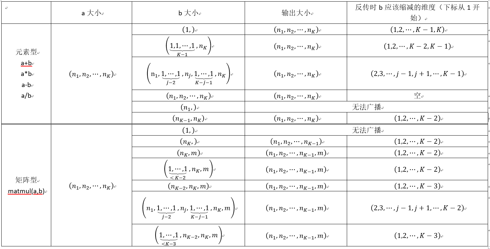
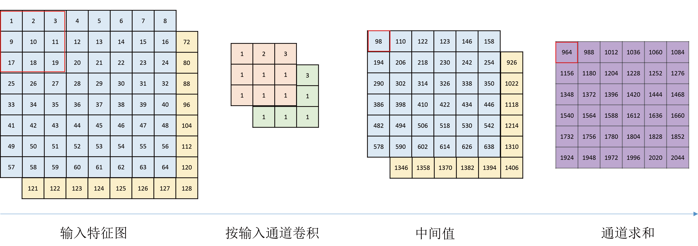
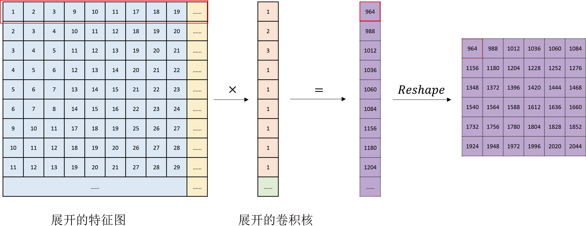
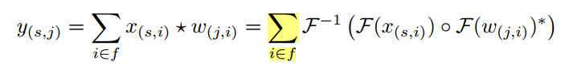
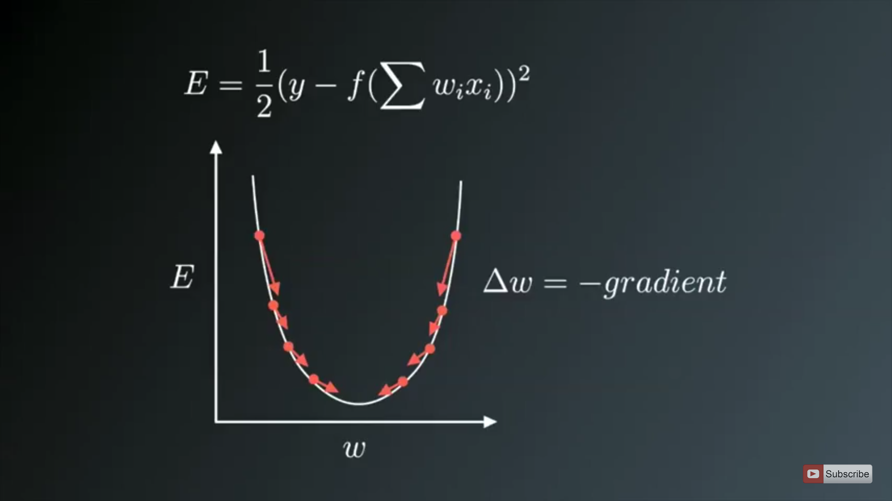
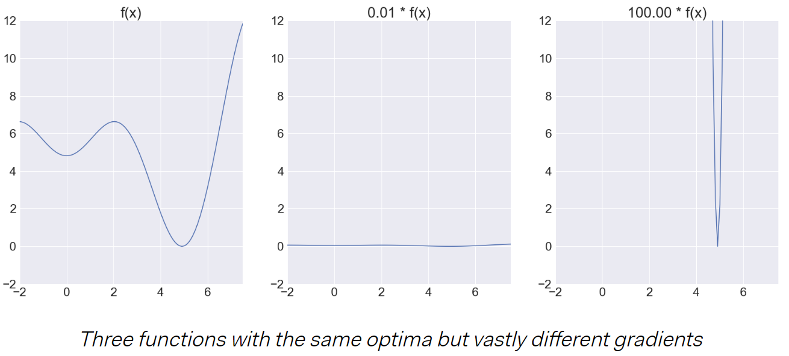

## 计算库实现探究

[TOC]

### 张量广播规律

张量计算过程中会有各种广播问题。由于自定义数据结构（``Zhangliang``）实际上是对``numpy.ndarray``的又一次封装，前馈过程的广播（``broadcast``）可由``numpy``内置运算确定，张量各维度需满足一定的关系才能完成广播。目前观察到张量在各个库（``numpy``，``tensorflow``和``pytorch``）内存在两类广播形式，我们这里分别称为"元素型"和"矩阵型"（下表中的``n``下标从1开始）：

可以看到不同的广播类型在反传时需要有不同的维度缩减策略。但事实上我们可以大致总结出不同广播类型需要满足的条件。

假定两个变量的大小分别为：$(a_1,a_2,...,a_m)$以及$(b_1,b_2,...,b_n)$。不失对称性，假定$n<m$。那么元素级运算的广播需满足：
$$
(a_1,a_2,...,a_m) \sim (\underbrace{1,1,...,1}_{n-m},b_1,b_2,...,b_n)
$$
也即，在广播时，``numpy``会尝试将维度较小的那个变量进行维度扩增（填充1），扩增至$m$。如果扩增后的两个维度互容，那么则允许广播。

类似的，矩阵型的广播条件为：
$$
\begin{align}
(a_1,a_2,...,a_m) &\sim (\underbrace{1,1,...,1}_{n-m},b_1,b_2,...b_{n-1},b_n) \\
\mathrm{s.t.}\quad& a_m = b_{n-1}
\end{align}
$$
确定了广播条件，我们就能在反传时确定输出梯度如何反馈到输入张量。我们举个例子说明反传时的维度缩减情况。

##### 元素级运算

假定两个矩阵$a$大小为$2\times 1$，$b$大小为$2\times 2$：
$$
\begin{equation}
a = \begin{bmatrix}
x_1 \\
x_2 
\end{bmatrix},\quad
b = \begin{bmatrix}
y_{11} & y_{12} \\
y_{21} & y_{22}
\end{bmatrix}
\end{equation}
$$
两者的四则运算为（以加法为例）：
$$
\begin{equation}
c=a\oplus b=\begin{bmatrix}
x_1 \\
x_2 
\end{bmatrix}\oplus
\begin{bmatrix}
y_{11} & y_{12} \\
y_{21} & y_{22}
\end{bmatrix}
=
\begin{bmatrix}
x_1+y_{11} & x_1+y_{12} \\
x_2+y_{21} & x_2+y_{22}
\end{bmatrix}
=
\begin{bmatrix}
\tilde{y}_{11} & \tilde{y}_{12} \\
\tilde{y}_{21} & \tilde{y}_{22}
\end{bmatrix}
\end{equation}
$$
输出大小为$2\times 2$。在反向传播时，损失值传到变量$c$应该同样为$2\times 2$大小。那么传回变量$a$和$b$时：
$$
\begin{align}
\frac{\partial l}{\partial x_1}&=\frac{\partial l}{\partial \tilde{y}_{11}}\frac{\partial \tilde{y}_{11}}{\partial x_1}+\frac{\partial l}{\partial \tilde{y}_{12}}\frac{\partial \tilde{y}_{12}}{\partial x_1}=\frac{\partial l}{\partial \tilde{y}_{11}}+\frac{\partial l}{\partial \tilde{y}_{12}} \\
\frac{\partial l}{\partial y_{11}}&=\frac{\partial l}{\partial \tilde{y}_{11}}\frac{\partial \tilde{y}_{11}}{\partial y_{11}}=\frac{\partial l}{\partial \tilde{y}_{11}}
\end{align}
$$
记上层传播到张量$c$的Jacobian为：
$$
\begin{equation}
\nabla_cl=\begin{bmatrix}
\dfrac{\partial l}{\partial \tilde{y}_{11}} & \dfrac{\partial l}{\partial \tilde{y}_{12}}\\
\dfrac{\partial l}{\partial \tilde{y}_{21}} & \dfrac{\partial l}{\partial \tilde{y}_{22}}
\end{bmatrix}
\end{equation}
$$
那么：
$$
\begin{align}
\nabla_al&=\mathrm{ReducedSum}(\nabla_cl,dim=1)  \\
\nabla_bl&=\nabla_cl
\end{align}
$$
元素乘法类似：
$$
\begin{equation}
c=a+b=\begin{bmatrix}
x_1 \\
x_2 
\end{bmatrix}\otimes
\begin{bmatrix}
y_{11} & y_{12} \\
y_{21} & y_{22}
\end{bmatrix}
=
\begin{bmatrix}
x_1y_{11} & x_1y_{12} \\
x_2y_{21} & x_2y_{22}
\end{bmatrix}
=
\begin{bmatrix}
\tilde{y}_{11} & \tilde{y}_{12} \\
\tilde{y}_{21} & \tilde{y}_{22}
\end{bmatrix}
\end{equation}
$$

$$
\begin{align}
\frac{\partial l}{\partial x_1}&=\frac{\partial l}{\partial \tilde{y}_{11}}\frac{\partial \tilde{y}_{11}}{\partial x_1}+\frac{\partial l}{\partial \tilde{y}_{12}}\frac{\partial \tilde{y}_{12}}{\partial x_1}=\frac{\partial l}{\partial \tilde{y}_{11}}y_{11}+\frac{\partial l}{\partial \tilde{y}_{12}}y_{12} \\
\frac{\partial l}{\partial y_{11}}&=\frac{\partial l}{\partial \tilde{y}_{11}}\frac{\partial \tilde{y}_{11}}{\partial y_{11}}=\frac{\partial l}{\partial \tilde{y}_{11}}x_1
\end{align}
$$

所以：
$$
\begin{align}
\nabla_al&=\mathrm{ReducedSum}(\nabla_cl\otimes b,dim=1)  \\
\nabla_bl&=\nabla_cl\otimes a
\end{align}
$$
这里的``dim``参数序号从0开始。

##### 矩阵级运算

假定两个矩阵，$a$大小为$2\times 1$，$b$大小为$4\times 1\times 3$：
$$
\begin{equation}
a = \begin{bmatrix}
x_1 \\
x_2 
\end{bmatrix},\quad
b = \begin{bmatrix}
\begin{bmatrix}
y_{11} & y_{12} & y_{13}
\end{bmatrix}\\
\begin{bmatrix}
y_{21} & y_{22} & y_{23}
\end{bmatrix}\\
\begin{bmatrix}
y_{31} & y_{32} & y_{33}
\end{bmatrix}\\
\begin{bmatrix}
y_{41} & y_{42} & y_{43}
\end{bmatrix}\\
\end{bmatrix}
\end{equation}
$$
由于矩阵乘法实际参与运算的维度是最后两维，所以两者的矩阵乘结果为$4\times2\times3$大小：
$$
\begin{equation}
\begin{split}
c&=a\times b=\begin{bmatrix}
x_1 \\
x_2 
\end{bmatrix}\times
\begin{bmatrix}
\begin{bmatrix}
y_{11} & y_{12} & y_{13}
\end{bmatrix}\\
\begin{bmatrix}
y_{21} & y_{22} & y_{23}
\end{bmatrix}\\
\begin{bmatrix}
y_{31} & y_{32} & y_{33}
\end{bmatrix}\\
\begin{bmatrix}
y_{41} & y_{42} & y_{43}
\end{bmatrix}\\
\end{bmatrix}
\\
&=
\begin{bmatrix}
\begin{bmatrix}
x_1y_{11} & x_1y_{12} & x_1y_{13} \\
x_2y_{11} & x_2y_{12} & x_2y_{13}
\end{bmatrix}\\
\begin{bmatrix}
x_1y_{21} & x_1y_{22} & x_1y_{23} \\
x_2y_{21} & x_2y_{22} & x_2y_{23}
\end{bmatrix}\\
\begin{bmatrix}
x_1y_{31} & x_1y_{32} & x_1y_{33} \\
x_2y_{31} & x_2y_{32} & x_2y_{33}
\end{bmatrix}\\
\begin{bmatrix}
x_1y_{41} & x_1y_{42} & x_1y_{43} \\
x_2y_{41} & x_2y_{42} & x_2y_{43}
\end{bmatrix}\\
\end{bmatrix}
=
\begin{bmatrix}
\begin{bmatrix}
z_{111} & z_{112} & z_{113} \\
z_{211} & z_{212} & z_{213}
\end{bmatrix}\\
\begin{bmatrix}
z_{121} & z_{122} & z_{123} \\
z_{221} & z_{222} & z_{223}
\end{bmatrix}\\
\begin{bmatrix}
z_{131} & z_{132} & z_{133} \\
z_{231} & z_{232} & z_{233}
\end{bmatrix}\\
\begin{bmatrix}
z_{141} & z_{142} & z_{143} \\
z_{241} & z_{242} & z_{243}
\end{bmatrix}\\
\end{bmatrix}
\end{split}
\end{equation}
$$
于是不难得到：
$$
\begin{align}
\frac{\partial l}{\partial x_1}&=\sum_{i=1}^4\sum_{j=1}^3\frac{\partial l}{\partial z_{1ij}}\frac{\partial z_{1ij}}{\partial x_1}=\sum_{i=1}^4\sum_{j=1}^3\frac{\partial l}{\partial z_{1ij}}y_{ij} \\
\frac{\partial l}{\partial y_{11}}&=\sum_{i=1}^2\frac{\partial l}{\partial z_{i11}}\frac{\partial z_{i11}}{\partial y_{11}}=\sum_{i=1}^2\frac{\partial l}{\partial z_{i11}}x_i
\end{align}
$$
因此，类似的，如果记：
$$
\begin{equation}
\nabla_cl=\begin{bmatrix}
\dfrac{\partial l}{\partial z_{ijk}}
\end{bmatrix}
_{4\times2\times3}
\end{equation}
$$
那么反传时的梯度为：
$$
\begin{equation}
\begin{split}
\nabla_al&=\mathrm{ReducedSum}(\nabla_cl\times b^T, dim=0) \\
\nabla_bl&=a^T\times\nabla_cl
\end{split}
\end{equation}
$$
这里的转置是对张量最后两个维度进行转换。

从上述的例子中可以发现，我们需要根据输入张量和输出张量之间的维度差别，从而找出对每个输入应该如何变换其数据形状才能计算出其对应的梯度。

##### 部分不可导函数的微分近似

| 函数                    | 近似微分 |
| ----------------------- | -------- |
| ``abs``                 |          |
| ``max``/``min``         |          |
| ``maximum``/``minimum`` |          |

##### 浮点数精度问题

在编写测试脚本时发现一个问题：``np.float32``精度比较低，经常导致测试通不过。改成``np.float64``稍微好一点。但是实际使用时，神经网络其实可以允许一定的截断误差，而且这些截断误差可能有利于网络的训练（比如跳出局部最优点）。因此，测试时使用``np.float64``，而实际使用时``np.float32``即可。

### 算子实现

这一节探讨下各种算子的实现问题，也会简单分析下各种算子的梯度计算问题。梯度计算这一过程，事实上大部分都能在网上找到计算公式，但是自己实现过程中还是需要推导一下，这一过程中也能更好地理解其工程考虑。

#### Sigmoid算子

假定输入为$x$（可以是标量或者张量），那么输出为：
$$
\begin{align}\label{eq:sigmoid positive}
z_i =\dfrac{1}{1+e^{-x_i}}
\end{align}
$$
记$y_i=e^{x_i}$，那么：
$$
\begin{align}
z_i =\dfrac{y_i}{1+y_i}
\end{align}
$$
于是有：
$$
\begin{align}
\dfrac{\partial z_i}{\partial x_i}&=\dfrac{\partial z_i}{\partial y_i}\dfrac{\partial y_i}{\partial x_i}\\
&=\dfrac{1+y_i-y_i}{(1+y_i)^2}e^{x_i}\\
&=\dfrac{1}{(1+y_i)^2}y_i\\
&=\dfrac{1}{1+y_i}\dfrac{y_i}{1+y_i}\\
&=(1-z_i)z_i
\end{align}
$$
具体实现还有一点需要考虑：式$\eqref{eq:sigmoid positive}$适用于$x$为正的情况，当$x$为负且绝对数值较大时，$e^{-x}$会造成数值溢出，此时较好的实现应该是：
$$
\begin{align}
z=\dfrac{e^x}{1+e^x}
\end{align}
$$
因此，需要根据$x$内每个点的数值情况分别使用不同的计算方法，以保证不会溢出。

#### Softmax算子

同样假定输入为$x$，那么输出为：
$$
\begin{align}
z_i =\dfrac{e^{x_i}}{\sum_{j}e^{x_j}}
\end{align}
$$
记$y_i=e^{x_i}$，那么：
$$
\begin{align}
z_i =\dfrac{y_i}{\sum_j y_j}
\end{align}
$$
于是$j\ne i$时，$\dfrac{\partial y_j}{\partial x_i}=0$，有：
$$
\begin{equation}\begin{split}\dfrac{\partial z_i}{\partial x_i}&=\sum_j\dfrac{\partial z_i}{\partial y_j}\dfrac{\partial y_j}{\partial x_i}\\&=\dfrac{\partial z_i}{\partial y_i}\dfrac{\partial y_i}{\partial x_i}\\&=\dfrac{\sum_j y_j-y_i}{(\sum_jy_j)^2}e^{x_i}\\&=\left(\dfrac{1}{\sum_jy_j}-\dfrac{y_i}{(\sum_jy_j)^2}\right)y_i\\&=\dfrac{y_i}{\sum_jy_j}-\left(\dfrac{y_i}{\sum_jy_j}\right)^2\\&=(1-z_i)z_i\end{split}\end{equation}
$$
同理，$k\ne i$时
$$
\begin{equation}\begin{split}\dfrac{\partial z_k}{\partial x_i}&=\sum_j\dfrac{\partial z_k}{\partial y_j}\dfrac{\partial y_j}{\partial x_i}\\&=\dfrac{\partial z_k}{\partial y_i}\dfrac{\partial y_i}{\partial x_i}\\&=\dfrac{-y_k}{(\sum_jy_j)^2}e^{x_i}\\&=-\dfrac{y_k}{\sum_jy_j}\dfrac{y_i}{\sum_jy_j}\\&=-z_iz_k\end{split}\end{equation}
$$
于是，$z$对输入$x$的Jacobian矩阵为：
$$
\begin{equation}\dfrac{\partial z}{\partial x}=\begin{bmatrix}(1-z_1)z_1 & -z_2z_1 & \cdots & -z_Nz_1 \\-z_1z_2 & (1-z_2)z_2 & \cdots & -z_Nz_2 \\\vdots  & \ddots & & \vdots \\-z_1z_N & -z_2z_N & \cdots & (1-z_N)z_N\end{bmatrix}\end{equation}
$$
因此，损失项对$x$的导数为：
$$
\dfrac{\partial L}{\partial x}=\dfrac{\partial L}{\partial z}\times\dfrac{\partial z}{\partial x}\\
\begin{split}
\dfrac{\partial L}{\partial x_i}&=dz_i*(1-z_i)z_i+\sum_{j\ne i}^Ndz_j*(-z_jz_i)\\
&=z_idz_i-z_i\sum_{j=1}^Nz_jdz_j=z_i\left(dz_i-\sum_{j=1}^Nz_jdz_j\right)
\end{split}
$$
``softmax``算子同样有溢出的问题，但是比较好处理。一个通常的方法是找出对应维度的最大值，然后减去这个最大值，保证$e^x$中的$x$小于0：
$$
\begin{align}\tilde{x}&=x-\max(x,dim)\\z&=\dfrac{e^{\tilde{x}}}{\mathrm{ReduceSum}(e^{\tilde{x}},dim)}\end{align}
$$

### 卷积算子

参考资料：

- [FAST CONVOLUTIONAL NETS WITH fbfft : A GPU PERFORMANCE EVALUATION](https://research.fb.com/wp-content/uploads/2016/11/fast-convolutional-nets-with-fbfft-a-gpu-performance-evaluation.pdf?)
- [Fast Algorithms for Convolutional Neural Networks](https://arxiv.org/pdf/1509.09308.pdf)
- [Leonardo的博客](https://leonardoaraujosantos.gitbooks.io/artificial-inteligence/content/making_faster.html)
- [Sahnimanas的博客](https://sahnimanas.github.io/post/anatomy-of-a-high-performance-convolution/)
- [Jonathan Ragan-Kelley的博士论文](http://people.csail.mit.edu/jrk/jrkthesis.pdf)
- [贾扬清的备忘录](https://github.com/Yangqing/caffe/wiki/Convolution-in-Caffe:-a-memo)

卷积作为现代神经网络中最重要的算子，其实现需要特定的优化。卷积过程本质上仍可看成是对图像每个局部区域内的信息进行矩阵乘法，因此实现卷积算子时力求将这一个过程进行加速和优化。这其中又涉及到算法具体实现时的各种问题，计算调度、缓存调度、并行计算等（事实上其他算子也有这些问题，只是在卷积算子中这些问题更加突出）。由于笔者能力有限，暂时未完成这一部分。

目前各大框架对卷积的实现有四种方法：

- 直接计算
- 通过``im2col``方法，将卷积完全转化为两个矩阵的乘法
- 通过``FFT``进行计算
- 通过``winograd``方法

#### 直接计算

朴素计算方法比较直观，给定一个$cin$通道数的特征图/图像，一个卷积核对每个通道内的数据进行滑动窗口内元素乘法加和运算，如此生成一个$cin$通道的中间特征图，再将各通道数据进行求和获得最终的输出。这种运算可以用于$cout$个不同的卷积核同时进行运算，最终形成$cout$通道的输出特征图。
很明显，朴素计算方法没有任何的优化，假定输入特征图大小为$S\times n\times n\times f$，卷积核大小$f'\times f\times k\times k$，步长$1$，没有$padding=1$，输出特征图大小为$S\times n\times n\times f'$，实际上乘法执行次数为$Sff'n^2k^2$，加法执行次数为$Sff'n^2k^2$。我们知道计算机里面乘法的运算时间比加法大很多。将“一次乘法+一次加法”称为一个“FLOP”，那么朴素计算所需的复杂度可表示为$O(Sff'n^2k^2)$ FLOPs。

#### 通过``im2col``方法

观察卷积运算过程，其实就是每个位置上的特征数据与对应位置的核参数进行相乘后，再对局部区域进行求和的操作，再对各通道求和，本质就可看成是矩阵/向量之间的乘法。所以``im2col``的思路就是将特征图局部和卷积核进行展开，处理成矩阵或向量来完成运算。这样展开成大矩阵，通过矩阵乘法对卷积运算进行加速。我们知道矩阵乘法已经有了加速的方法，因此卷积的效率可以进一步提高。上图中展示了一个具体过程。

#### 通过FFT进行计算

卷积过程顾名思义，来自于信号处理邻域。那么在信号处理中常用的傅里叶变换自然也可用于与实现卷积的计算，而且比朴素方法更加高效：

其中$\circ$是点对点乘积，$*$是共轭。相比于朴素算法的$O(Sff'n^2k^2)$复杂度，通过FFT计算卷积的复杂度只需要$O(Sff'n^2+(Sf+ff'+Sf')n^2\log n)$。基于FFT的卷积方法通常将空间维度$n$分解为若干个基础卷积算子的组合，比如$2\times2$，$3\times3$，$5\times5$，$7\times7$，计算这些组合的结果后再计算总的输出结果。如果$n$不能分解为这些质数卷积核的组合，那么就比$n$大且能分解为上述质数组合的最快的点数$n'$的卷积，然后再取对应的值。由于FFT的性质，在卷积核较小问题规模也较小时，基于FFT的卷积性能反而可能不如朴素方法；但随着问题规模的增大，或者卷积核较大时，基于FFT的卷积性能要远远好于朴素卷积方法，以及``im2col``方法。

#### 通过``winograd``方法

``Winograd``则是另一种优化思路，通过优化计算的流程来加快卷积过程。通常对于较小的卷积核，用winograd方法计算会比较快。

### 优化方法

参考资料：

- [Rprop](https://florian.github.io/rprop/)
- [Caffe Solver](http://caffe.berkeleyvision.org/tutorial/solver.html)
- [深度学习最全优化方法总结比较（SGD，Adagrad，Adadelta，Adam，Adamax，Nadam）](https://zhuanlan.zhihu.com/p/22252270)
- [Types of Optimization Algorithms used in Neural Networks and Ways to Optimize Gradient Descent](https://towardsdatascience.com/types-of-optimization-algorithms-used-in-neural-networks-and-ways-to-optimize-gradient-95ae5d39529f)
- [PyTorch与caffe中SGD算法实现的一点小区别](https://zhuanlan.zhihu.com/p/43016574)

常见的网络优化方法包括以下若干种：

| 方法                                                         | 优化规则                                                     | 备注                          |
| ------------------------------------------------------------ | ------------------------------------------------------------ | ----------------------------- |
| [Momentum SGD](https://www.microsoft.com/en-us/research/wp-content/uploads/2012/01/tricks-2012.pdf) | $v_{t+1}=\mu v_t-\alpha\nabla L_{w}\\ w_{t+1}=w_t+v_{t+1}$   | $\mu$是动量，$\alpha$是学习率 |
| [AdaGrad](http://www.jmlr.org/papers/volume12/duchi11a/duchi11a.pdf) | $w_{t+1}=w_t-\dfrac{\alpha}{\sqrt{\sum_{\tau=1}^t(\nabla L_{w})^2_\tau}}\nabla L_w$ |                               |
| [AdaDelta](https://arxiv.org/pdf/1212.5701.pdf)              | $v_{t+1}=-\dfrac{RMS[v]_{t}}{RMS[g]_{t+1}}g_{t+1}\\w_{t+1}=w_t+v_{t+1}$ | RMS是root of mean squared     |
| [Adam](https://arxiv.org/pdf/1412.6980.pdf)                  | $m_t=\beta_1m_{t-1}+(1-\beta_1)\nabla L_w\\v_t=\beta_2v_{t-1}+(1-\beta_2)(\nabla L_w)^2\\w_{t+1}=w_t-\alpha\dfrac{\sqrt{1-\beta_2^t}}{1-\beta_1^t}\dfrac{m_t}{\sqrt{v_t}+\epsilon}$ | 自动矩估计                    |
| [Nesterov](http://www.cs.toronto.edu/~fritz/absps/momentum.pdf) | $v_{t+1}=\mu v_t-\alpha\nabla L_{w_t+\mu v_t}\\w_{t+1}=w_t+v_{t+1}$ |                               |
| [RMSprop](http://www.cs.toronto.edu/~tijmen/csc321/slides/lecture_slides_lec6.pdf) | $MS(w_t)=\delta MS(w_{t-1})+(1-\delta)\nabla L_{w}^2\\w_{t+1}=w_t-\alpha\dfrac{\nabla L_w}{\sqrt{MS(w_t)}}$ |                               |
| [Rprop](http://www.neuro.nigmatec.ru/materials/themeid_17/riedmiller93direct.pdf) | $v_{t+1}=-\alpha_{t+1}*sgn\left(\nabla L_w\right)\\w_{t+1}=w_{t}+v_{t+1}\\\alpha_{t+1}=\begin{cases}\min(\alpha_t*a,\alpha_{max}), ~if~\nabla_{w_{t+1}}L*\nabla_{w_t}L>0\\\max(\alpha_t*b,\alpha_{min}), ~if~\nabla_{w_{t+1}}L*\nabla_{w_t}L<0\\\alpha_t,~otherwise\end{cases}$ | $a>1>b$，典型值$a=1.2,~b=.5$  |

#### 随机梯度下降SGD

简单回顾下随机梯度下降方法。在没有解析解的情况下，我们知道优化一个函数往往是通过一些其他方法，其中梯度下降方法就是最重要的一种。其目的是从某个点开始，沿着当前点的负梯度方向逐步找到函数的极小值点。

对于机器学习任务，可能有大量数据用于学习$\{(x_1,y_1),(x_2,y_2),...,(x_N,y_N)\}$。学习时，一种方法就是每次都使用所有数据对模型参数进行调整：
$$
\begin{align}
\Delta w&=-\sum_{i=1}^N \nabla_w L(x_i,y_i) \\
w_{t+1}&=w_t + \alpha\Delta w
\end{align}
$$
若干次迭代优化达到收敛即可。当$N$较小时，上式方法仍比较高效；但随着$N$的逐渐增大，同时计算所有样本对这一过程成为了训练的瓶颈。无论是内存、显存或者算力，都无法支持如此大量数据同时进行训练和迭代；而逐批输入数据再汇总则具有巨大的时间开销，也是不可取的。因此随机梯度下降方法也就应运而生。它是对上式的一种极端简化：每次迭代只取一个样本计算梯度。
$$
\begin{align}
\Delta w&=-\nabla_w L(x_i, y_i)\\
w_{t+1}&=w_t + \alpha\Delta w
\end{align}
$$
而这个样本也是每次迭代随机选取的。由于SGD不知道每次使用的是什么数据，或者之前是否已使用过，这种随机性以及一个独立样本内包含的噪声干扰能够一定程度上提升模型的泛化能力。SGD的收敛性有Robbins-Siegmund定理保证，只需要满足$\sum_t\alpha_t^2<\infin$以及$\sum_t\alpha_t=\infin$。

但上述极端简化方法仍存在一个问题：样本噪声在提升鲁棒性和泛化性的同时，也使得SGD收敛得非常慢。所以在实现上，现代的SGD了吸收了两种极端情况的各自优点，将单例更新修改为了批数据更新：
$$
\begin{align}
\Delta w&=-\sum_{i=1}^B\nabla_w L(x_i, y_i)\\
w_{t+1}&=w_t + \alpha\Delta w
\end{align}
$$
其中$B$是批大小。基于批的SGD既提高了单例SGD的收敛速度，也保留了样本的随机性使得模型更具泛化性能。当然SGD本身又有可改进之处。

#### 二阶优化方法

在介绍SGD的各种改进方法之前，有必要介绍下二阶的优化方法。我们称普通的梯度下降方法是一阶的，因为它们只用到了损失函数$\mathcal{L}$对参数$w$的一阶导数。事实上，优化方法可以使用更高阶的信息，比如二阶优化方法（Newton法、拟Newton法等）用到了Hessian矩阵来调整演化的方向：
$$
\Delta w=-\dfrac{1}{|\mathrm{diag}(H_t)|+\mu}\nabla_wL
$$
通常，高阶优化方法比一阶方法具有更快的收敛速度，当然也是有代价的：需要计算$\mathcal{L}$对参数$w$的二阶导数（Hessian矩阵），这是一个时间复杂度和空间复杂度都很高的过程。

#### Momentum SGD （带动量的SGD）

SGD存在一个问题是会产生振荡，因此收敛更难更慢。动量方法是SGD最常用最有效的一种改进，其思想是增强梯度持续指向方向的演化速度，减缓梯度符号变化之处的演化进程。做到这两点只需要一个小小的改进：
$$
\begin{align}
\Delta w_{t+1}&=\rho\Delta w_{t}-\alpha\sum_{i=1}^B\nabla_w L(x_i, y_i)\label{eq:naive sgd A}\\
w_{t+1}&=w_t + \Delta w_{t+1}\label{eq:naive sgd B}
\end{align}
$$
其中$\rho\in[0,1]$是动量参数。通过引入动量$\rho$，梯度演化方法将受到历史演化方向的影响。在梯度主方向，演化速度会累计提升加速；而在异常点，新的梯度方向影响较小，也就避免了参数在某个点附近振荡，加速了优化过程。

这里需要提到一点，事实上根据FAIR的[论文](https://arxiv.org/pdf/1706.02677.pdf)，朴素的动量SGD的学习率不是立即生效的，因为学习率$\alpha$只是被应用在了新的梯度上；当$\alpha$发生变化时，动量方向仍旧保持为前一时刻的方向，并且需要很长时间才能调整到新的方向。所以``PyTorch``在实现优化器时，使用的不是$\eqref{eq:naive sgd A}$和$\eqref{eq:naive sgd B}$，而是调整为：
$$
\begin{align}
\Delta w_{t+1}&=\rho\Delta w_{t}-\sum_{i=1}^B\nabla_w L(x_i, y_i)\label{eq:fair sgd A}\\
w_{t+1}&=w_t + \alpha\Delta w_{t+1}\label{eq:fair sgd B}
\end{align}
$$
这样在$\alpha$改变时演化立即就能生效。这还带来一个额外的好处，就是在实施**权重衰减**时也能避免衰减项主导演化速度和方向。考察权重衰减项$\frac{\lambda}{2}||w||^2$，通常这一项是单独加入更新中的。按照式$\eqref{eq:naive sgd A}$，加入衰减后的权重更新变为：
$$
\begin{align}
\Delta w_{t+1}&=\rho\Delta w_{t}-\alpha\sum_{i=1}^B\nabla_w L(x_i, y_i)-\lambda w_t\label{eq:naive sgd 2A}\\
w_{t+1}&=w_t + \Delta w_{t+1}\label{eq:naive sgd 2B}
\end{align}
$$
那么在更新权重时，如果学习率很小，衰减项将占据主导地位从而影响收敛和网络性能。如果按照``PyTorch``的实现方法，加入衰减的权重更新则变为了：
$$
\begin{align}
\Delta w_{t+1}&=\rho\Delta w_{t}-\sum_{i=1}^B\nabla_w L(x_i, y_i)-\lambda w_t\\
w_{t+1}&=w_t + \alpha\Delta w_{t+1}\label{eq:fair sgd 2B}
\end{align}
$$
可以看到，在``PyTorch``版本的SGD中，衰减项对演化速度和方向的影响要小于原实现。

#### Nesterov Accelerated Gradient

Yurii Nesterov观察到动量方法的一个问题：动量SGD无法预见到极值点应该减小演化速度。当优化达到某个极值点时，优化速度应该减小并趋于0；而由于动量的存在，动量SGD需要很长时间才能减小演化速度，甚至错过极值点。Nesterov的解决方法简单直接：相比于计算当前参数的梯度，我们可以前瞻一步查看下一步参数的梯度方向。如果这个未来的梯度方向与当前方向是反向的，那么应该减小当前的演化速度：
$$
\begin{align}
\Delta w_{t+1}&=\rho\Delta w_{t}-\alpha\sum_{i=1}^B\nabla_{w+\rho\Delta w} L(x_i, y_i)\\
w_{t+1}&=w_t + \Delta w_{t+1}
\end{align}
$$
这一方法能够根据梯度大小和符号自适应调整演化速度。

#### Resilient Propagation (Rprop)

弹性反向传播基于一个有趣的发现：梯度下降优化过程很可能与梯度绝对数值大小无关，而与梯度的符号有关。为了说明这一点，定义一个函数$f$，然后相应地定义另外两个函数，都是对$f$赋予一个scale量：

第二、第三个图与原函数$f$相差一个尺度量。显然三者有一个相同的最优点，但是三个函数的各点的梯度绝对数值却也差了一个scale。于是，在不知道理论函数与实际函数的尺度情况下，确定演化步长$\alpha$是个比较困难的事情。基于梯度的绝对数值来确定学习率就可能导致优化过程无法收敛到极值点。``Rprop``方法提出使用梯度符号来进行优化，并且提出一种自适应学习率的方法来调整演化步长：
$$
\begin{align}
v_{t+1}&=-\alpha_{t+1}*sgn\left(\nabla L_w\right)\\
w_{t+1}&=w_{t}+v_{t+1}\\
\alpha_{t+1}&=\begin{cases}\min(\alpha_t*a,\alpha_{max}), ~if~\nabla_{w_{t+1}}L*\nabla_{w_t}L>0\\\max(\alpha_t*b,\alpha_{min}), ~if~\nabla_{w_{t+1}}L*\nabla_{w_t}L<0\\\alpha_t,~otherwise\end{cases}
\end{align}
$$
``Rprop``的另一个优点是，能够根据每个参数梯度的数值大小自适应调整参数的学习率。换言之，由于量级不同，我们可能很难找到一个全局的学习率适合于所有参数，但是``Rprop``使得每个不同的参数都具有自己的学习率，这就能够克服梯度量级不同的问题。当然``Rprop``也有自己的缺陷，比如``Rprop``只适用于大批次数据，而对小批次数据不太适合。这是因为不同批次数据的梯度符号可能会不同，小批次数据的梯度符号变动较频繁，导致``Rprop``学习无法收敛。

#### RMSprop

正因为``Rprop``无法用于小批次数据，Tieleman提出了``RMSprop``将``Rprop``的思想应用于小批次数据。其想法也很简单：``Rprop``对每个batch都会除以一个不同的数，那么为什么不对相邻mini-batch除以不同的scale呢（并且每批次的scale只是略有不同）？实现这个思想的方法也很简单，只需要维护一个浮动的统计数据：
$$
\begin{align}
MS(w_t)&=\delta MS(w_{t-1})+(1-\delta)\nabla L_{w}^2\\
w_{t+1}&=w_t-\alpha\dfrac{\nabla L_w}{\sqrt{MS(w_t)}}
\end{align}
$$
其中$\delta$默认取$0.9$（Tieleman论文）或者$0.99$（Caffe默认）

#### AdaGrad

``AdaGrad``是另一种自适应学习率的方法。类似与``RMSprop``，其梯度被除以了一个尺度量：
$$
\begin{align}
MS(w_t)&=MS(w_{t-1})+(\nabla L_{w})^2\\
w_{t+1}&=w_t-\alpha\dfrac{\nabla L_w}{\sqrt{MS(w_t)}}
\end{align}
$$
注意到第一式与``RMSprop``中略有不同。在``RMSprop``中，浮动量$MS(w_t)$是由手动设定的数值$\delta$控制更新的，为固定值；而``AdaGrad``中是按照迭代次数$t$进行累计。这么做也有一个额外的优点，即学习率自主地随着时间减小，类似于退火技术。但是这也带来几个问题：

- ``AdaGrad``方法对于初始值比较敏感。比如，初始值具有较大的梯度值，那么后续所有的学习率实际上都被缩小了，造成学习缓慢；如果选择手动增大初始学习率，这反而又造成``AdaGrad``方法对初始学习率敏感了。
- 学习率将随着训练过程的进行一直减小，直到无法再学习。

#### AdaDelta

``AdaDelta``着重针对``AdaGrad``的上述两个缺点，做了两点改进：

- 将梯度平方累计过程改为在一个窗口的时间；
- 一阶方法忽略了数值单位，所以使用近似二阶数据来弥补

事实上第一点与``RMSprop``的表达式是一致的，即：
$$
\begin{align}
E[g^2]_t&=\rho E[g^2]_{t-1}+(1-\rho)g^2_t\\
RMS[g]_t&=\sqrt{E[g^2]_t+\varepsilon}\\
v_{t}&=-\dfrac{\alpha}{RMS[g]_t}g_t
\end{align}
$$
其中$g_t=\nabla_{w_t}L$为$t$时刻的梯度。第二点，在一阶优化方法中，梯度和参数的度量单位都是被忽略的，都是有问题的：
$$
\mathrm{units~of}~\Delta w\propto\mathrm{units~of}~\nabla_wL\propto\dfrac{\partial\mathcal{L}}{\partial w}\propto\dfrac{1}{\mathrm{units~of}~x}
$$
相比之下二阶方法则保证了度量单位的统一：
$$
\mathrm{units~of~}\Delta w\propto H^{-1}\nabla_wL\propto\dfrac{\frac{\partial\mathcal{L}}{\partial w}}{\frac{\partial^2\mathcal{L}}{\partial w^2}}\propto\mathrm{units~of~}x
$$
可以看到，一阶方法和二阶方法在度量单位上相差了两级。而由于：
$$
\Delta w=\dfrac{\frac{\partial\mathcal{L}}{\partial w}}{\frac{\partial^2\mathcal{L}}{\partial w^2}}\Rightarrow\dfrac{1}{\frac{\partial^2\mathcal{L}}{\partial w^2}}=\dfrac{\Delta w}{\frac{\partial\mathcal{L}}{\partial w}}
$$
我们只需要在现有梯度更新的过程中加入类似于二阶导数倒数的scale即可：
$$
\begin{align}
v_{t+1}&=-\dfrac{RMS[v]_t}{RMS[g]_{t+1}}g_{t+1}\\
w_{t+1}&=w_t+v_{t+1}
\end{align}
$$

#### Adaptive Moments Esimation (Adam)

``Adam``方法集合了``AdaGrad``的优点（较适用于稀疏梯度）与``RMSprop``的优点，具有诸多优点：

- 对于梯度的赋值不敏感
- 演化步长由超参数控制
- 不需要稳态优化目标
- 能够适用于稀疏梯度
- 自动步长退火

``Adam``方法也很简单：直接用浮动数据（running average）来拟合和估计一阶矩和二阶矩，然后计算梯度方向：
$$
\begin{align}
m_t&=\beta_1m_{t-1}+(1-\beta_1)g_t\\
v_t&=\beta_2v_{t-1}+(1-\beta_2)g_t^2\\
w_{t+1}&=w_t-\alpha\dfrac{\sqrt{1-\beta_2^t}}{1-\beta_1^t}\dfrac{m_t}{\sqrt{v_t}+\epsilon}
\end{align}
$$
这一形式与``RMSprop``的动量版本非常相似。不同之处在于，``RMSprop``的动量版本是依靠梯度的幅值来调整动量，而``Adam``则是直接维护和估计了梯度的二阶矩；另外``RMSprop``缺少有偏修正量（bias-correction term），在稀疏梯度的应用中会造成较大步长而使得优化过程发散。

#### AdaMax

``AdaMax``是``Adam``的一个变体。``Adam``实际上在梯度更新时使用了一个``L2``范数进行scale，这可以推广到$Lp$范数。而当$p\rightarrow\infin$时就得到了：
$$
\begin{align}
m_t&=\beta_1m_{t-1}+(1-\beta_1)g_t\\
u_t&=\lim_{p\rightarrow\infin}(v_t)^{1/p}=\max(\beta_2\cdot u_{t-1},|g_t|)\\
w_{t+1}&=w_t-\alpha\dfrac{1}{1-\beta_1^t}\dfrac{m_t}{u_t+\epsilon}
\end{align}
$$